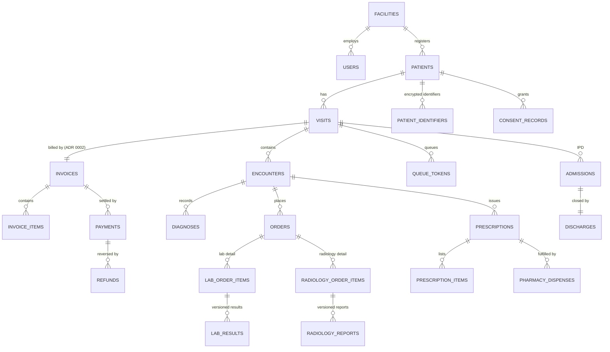

# HealthDoc Master Database Schema

## About this document

HealthDoc is a Hospital Information Management System (HMIS) for India's public health
network — ABDM V3-ready, DPDP-compliant, and built as an offline-resilient hybrid
edge-cloud system. This document defines the complete PostgreSQL schema that all seven
backend developers build against: every table, every column, every migration number,
and the API field contract between backend and frontend. How the modules connect and
flow at runtime is in `docs/architecture.html`; on conflicts: ADRs → this document →
architecture.html.

**Audience:** backend devs (B1–B7) writing migrations and modules; frontend devs (F1–F6)
consuming the API shapes in §4; reviewers checking migration PRs.

**How to read it:** §1 lists the five rules most drafts broke — read it first. §2 is the
migration map (who builds what, in which order). §3 is the table-by-table definition.
§4 is the API field contract. §5 is a personal fix list per developer. §6 is the build
dependency chain. §7 summarizes how sensitive data is protected. `§` means "section of
this document".

### Revision history

| Version | Date | Change |
|---|---|---|
| v1 | 2026-07-16 | Consolidation of the seven developer schema drafts |
| v2 | 2026-07-17 | ADR 0002: full departmental billing replaces registration-payment model; users table extended |
| v2.1 | 2026-07-17 | Review hardening: mobile varchar(20), enum widths varchar(30), FK + audit indexes, single versioning pattern, 0018 retired |
| v2.2 | 2026-07-17 | Security pass: crypto key_version on patient_identifiers, PII rules for notification payloads and error messages, page_size cap, retention notes; synced with architecture.html |
| v3.14 | 2026-07-28 | **Clinical & financial gaps found in review:** `allergies` table + ingredient-code matching rule + server-side prescribing gate (0032); `charge_master` with effective-dated and scheme tariffs, plus `UNIQUE (invoice_id, reference_type, reference_id)` to stop double-billing (0033); partial unique index enforcing one active admission per bed and a transfer destination on discharges (0034). Drug–drug interaction checking explicitly ruled out of scope pending a licensed database |
| v3.13 | 2026-07-28 | **PR-review corrections (found reviewing #265):** `departments.code` unique per facility not globally (global unique makes multi-facility impossible); `queue_counters` rescoped to (department, business date) so two doctors in one department cannot both issue `MED-001` to the same display board; `initial_priority` on `queue_tokens`; partial unique on live `visit_id` (a double-click at the desk otherwise 500s that patient's consultation completion forever); enum column widths corrected to varchar(50) per the blanket rule |
| v3.12 | 2026-07-23 | **Verification pass:** executable spec tests (10 passing) proving the timezone, race, invariant and concurrency findings; `scripts/spec_check.py` doc↔code drift checker added to CI; **restored §governance + user_account_requests/policies/outbox_events/idempotency_keys definitions silently dropped by an earlier edit**; fixed stale facility_modules block |
| v3.11 | 2026-07-23 | **§4A reliability & safety contracts:** idempotency keys, optimistic concurrency (row_version/If-Match), Mongo dual-write via outbox, file-upload validation, visit auto-close, DPDP erasure position, public-display hardening, Keycloak SPOF mitigation, backup RPO/RTO + paper fallback |
| v3.10 | 2026-07-23 | `blood_bank` made optional (5 toggleable modules); `procedure_records` added so procedures are recordable + billable without an OT |
| v3.9 | 2026-07-23 | **Architecture hardening:** async per-facility audit chaining, mandatory partition maintenance + DEFAULT partitions, facility timezone + business-date rule, break_glass_grants table, merge repointing rule (clinical safety), financial invariants, queue_counters, consent-expiry job, ICD-11 edge fallbacks, sync clock authority |
| v3.8 | 2026-07-22 | Role model resolved: `hod` role added (13 total), superadmin barred from merge/unmerge, unmerge → supervisor w/ different-approver rule, admin vs hod boundary, MFA on all authority roles; priority-elevation design + `queue_token_priority_changes` table |
| v3.7 | 2026-07-22 | Blood-bank API contract + frontend surface added; FHIR R4 conversion contract (resource mappers per module, coding/PII rules) |
| v3.6 | 2026-07-22 | Completeness audit: added missing table definitions + map rows for 0029 policies (ABAC), 0030 ABHA linking token, 0031 outbox_events |
| v3.5 | 2026-07-21 | OPD display board: queues gain room_id/display_label/now_serving_token_id/is_open; public /queue/display/{dept} board endpoint + SSE stream; token→doctor link and no-PII display contract documented |
| v3.4.1 | 2026-07-21 | Precision pass: invoice trigger frozen/mutable column lists, enum width rule → varchar(50), uhid NULL-unique note, no-FK-to-audit policy, facility_modules seeding, self-approval 409, UUID-only URL params; v3.5 backlog recorded |
| v3.4 | 2026-07-20 | Account governance: superadmin role (cloud-only, no clinical access), user_account_requests maker-checker (0028), documented /users, /audit/*, /reports/kpis endpoint contracts |
| v3.3 | 2026-07-20 | Facility module toggles (0027): per-hospital on/off for lab/radiology/pharmacy/IPD/OT/…, external-referral fulfilment on orders, capabilities endpoint; billing invariant unchanged |
| v3.2 | 2026-07-20 | ICD-11 promoted into MVP: WHO ICD-API container in compose, backend client + catalog seeder, diagnosis search endpoint contract |
| v3 | 2026-07-20 | Compliance wave (DPDP Rules 2025 + NABH DHS 2nd Ed): migrations 0021–0026 — DPO/grievances/breach log, consent managers, guardian verification, vitals & nursing, procurement, HR/KPI, FHIR transaction log; index strategy §3-end |

### Glossary

| Term | Meaning |
|---|---|
| ABDM | Ayushman Bharat Digital Mission — India's national digital health ecosystem (Gateway V3) |
| ABHA | Ayushman Bharat Health Account — patient's national health ID |
| UHID | Unique Hospital Identifier — permanent patient ID issued by HealthDoc |
| THID | Temporary Hospital ID — for unidentified/emergency patients, later merged into a UHID |
| DPDP | Digital Personal Data Protection Act, 2023 (India) — governs personal data handling |
| HFR | Health Facility Registry (ABDM) |
| FEFO | First-Expiry-First-Out — batch picking order for pharmacy stock |
| GRN | Goods Received Note — inventory receiving record |
| DAMA | Discharge Against Medical Advice |
| LWBS | Left Without Being Seen (OPD visit outcome) |
| OPD / IPD | Out-Patient / In-Patient Department |
| OT | Operating Theatre |
| PACS | Picture Archiving and Communication System (Orthanc, DICOM imaging) |
| Blind index | Deterministic HMAC of an identifier used for lookups without storing plaintext |
| DPDP Rules 2025 | The notified rules operationalizing the DPDP Act — breach intimation, DPO, consent managers, grievances |
| DPB | Data Protection Board of India — breach reports and grievance escalations go here |
| SDF | Significant Data Fiduciary — designation that triggers DPO + DPIA + annual audit duties |
| NABH DHS | NABH Digital Health Standards for Hospitals, 2nd Edition (Sept 2025) |

**Status: binding.** This is the single source of truth for every table, every migration
number, and every API field name. It consolidates the seven schema drafts submitted by
the team (Aditya, Khushi ×2, Priyanshu, Riya, Suprita, Vani), reconciled against
`docs/schema-conventions.md`. Where your draft differs from this document, **this
document wins** — your personal fix list is in §5.

Rules of engagement:

- Build exactly the tables in §3, with exactly these column names.
- Enum values come from `backend/app/common/enums.py` — already updated to match §3.
- Migration numbers and chain order come from §2. Do not renumber.
- API JSON field names = column names (snake_case), wrapped in the standard envelope (§4).
- Any change to this file = PR + Tech Lead review, same as `schema-conventions.md`.

---

## 1. The five global corrections (read first — most drafts break these)

1. **The primary key of every table is `id UUID`.** It is *never* called `uhid`,
   `order_id`, `item_id`, `donor_id`, or anything else. `uhid` is a *business
   identifier of a patient* — it exists as a unique column on `patients` only.
   Foreign keys always point at `<table>.id`, never at `uhid` or any business number.
2. **No integer / SERIAL primary keys anywhere.** Offline facilities sync to cloud;
   integer sequences collide. UUID via `uuid_generate_v4()` (use the `UUIDPk` mixin).
3. **`timestamptz` everywhere** (UTC). Never bare `TIMESTAMP`.
4. **Status values are lowercase snake_case from `enums.py`.** Not `'Pending'`,
   not `'Full Dispense'`, not `'OPD'`. Every status column gets a named CHECK
   constraint: `CheckConstraint(EnumClass.sql_check("status"), name="ck_<table>_status")`.
5. **People are `users.id` (UUID).** No `doctor_id INT`, no separate `doctor` table,
   no `staff_id INT`. Doctors, nurses, receptionists are all rows in `users`; role
   lives in Keycloak. Departments are `department_id UUID → departments.id`, never a
   varchar department name.

## 2. Migration map — numbers, owners, chain

Files: `backend/migrations/versions/<NNNN>_<slug>.py`, `revision = "<NNNN>"` (4-digit,
zero-padded — the issues say "005", the file and revision string say `0005`).
`down_revision` = the previous number in this table. **This chain is the build order;
do not merge out of order.**

| Rev | Slug | Tables | Owner (issue) |
|---|---|---|---|
| 0001 | extensions | uuid-ossp, pgcrypto, pg_trgm | B1 — merged ✅ |
| 0002 | facilities_users | facilities, users, idempotency_keys | B1 |
| 0003 | audit | audit_logs, audit_log_archive, audit_integrity_checks | B7 (B7-W1-01) |
| 0004 | consent | consent_purposes, consent_records, consent_withdrawals, data_access_log, consent_renewal_reminders, break_glass_grants | B7 (B7-W1-02) |
| 0005 | departments_rooms | departments, rooms | B4 (B4-W1-01) |
| 0006 | patients | patients, patient_identifiers, patient_merge_log | B2 (B2-W1-01) |
| 0007 | visits_encounters | visits, encounters, icd_codes, diagnoses | B3 (B3-W1-01) |
| 0008 | orders_prescriptions | orders, prescriptions, prescription_items, procedure_records, order_external_results | B3 (B3-W1-01) |
| 0009 | rosters_queues | rosters, queues, queue_counters, queue_tokens, queue_token_priority_changes | B4 (B4-W1-01) |
| 0010 | lab | lab_order_items, lab_results | B5 (B5-W1-01) |
| 0011 | radiology | radiology_order_items, radiology_reports | B5 (B5-W1-01) |
| 0012 | inventory | suppliers, inventory_items, stock_locations, inventory_batches, stock_ledger (+ FK prescription_items→inventory_items) | B6 (B6-W1-01) |
| 0013 | pharmacy | pharmacy_dispenses, pharmacy_dispense_items, grn, grn_items, indents, indent_items, adjustments, facility_settings | B6 (B6-W1-01) |
| 0014 | billing | invoices, invoice_items, payments, refunds, billing_counters | B7 (B7-W1-03 — **ADR 0002: full departmental billing**) |
| 0015 | admissions_discharge | wards, beds, admissions, discharges | B3 (B3-W1-01) |
| 0016 | blood_bank | blood_donors, blood_units | B5 (B5-W1-02, schema only) |
| 0017 | ot_stubs | ot_schedules, ot_records | B3 (B3-W1-02, schema only) |
| 0018 | — skipped, never create — | | |
| 0019 | files | files, file_access_log | B7 (B7-W1-03) — `down_revision = "0017"` |
| 0020 | notifications | notification_history | B4 (B4-W1-01) |
| 0021 | dpdp_compliance | data_protection_officers, patient_grievances, data_breach_notifications, consent_managers (+ FK consent_records.consent_manager_id) | B7 (W3) |
| 0022 | guardian_verification | ALTER patients: is_minor, guardian_verified, guardian_verification_method | B2 (W3) |
| 0023 | vitals_nursing | vitals, nursing_handover_notes, intake_output_records, patient_movement_log | B3 (W5) |
| 0024 | procurement | purchase_orders, purchase_order_items, stock_transfers, stock_transfer_items, machine_maintenance_logs (+ adjustments.adjustment_type) | B6 (W4) |
| 0025 | hr_kpi | staff_certifications, staff_training_records, kpi_snapshots | B1 (W5) |
| 0026 | fhir_notifications | fhir_bundle_transactions, discharge_notifications | B7 + B4 (W6) |
| 0027 | facility_modules | facility_modules (+ orders.fulfilment_mode) | B1 (W3) |
| 0028 | user_account_requests | user_account_requests | B1 (W3) |
| 0029 | abac_policies | policies | B1 (W2-02) |
| 0030 | abha_linking_token | ALTER patients: abha_linking_token_encrypted, abha_linking_key_version, abha_linked_at | B1 (W3-02) |
| 0031 | outbox | outbox_events (+ seq_outbox) | B1 (W6-01) |
| 0032 | allergies | allergies, ALTER inventory_items | B3 (B3-W?-01) |
| 0033 | charge_master | charge_master, ALTER invoice_items | B7 (B7-W?-01) |
| 0034 | ipd_bed_integrity | ALTER admissions, ALTER discharges | B4 (B4-W?-01) |

Because you're working in parallel: if the previous migration isn't merged yet, set
`down_revision` to its number anyway and coordinate merge order in the team channel.
CI runs `alembic upgrade head` — a broken chain fails the PR.

**About 0018:** Alembic revision ids are labels, not a sequence — `0019.down_revision
= "0017"` is a perfectly linear chain. The number 0018 is retired: **nobody may ever
create a revision `0018`** (it would fork the history into two heads and break every
environment). New migrations after 0020 take 0021, 0022, ...

## 3. Canonical table definitions

Notation: every table implicitly starts with
`id UUID PK DEFAULT uuid_generate_v4()` and ends with
`created_at / updated_at timestamptz NOT NULL DEFAULT now()` (the `UUIDPk` +
`Timestamps` mixins). `[Blame]` = also has `created_by UUID NOT NULL → users.id`,
`updated_by UUID NULL → users.id`. Only the *other* columns are listed.
`→` means FK to that table's `id`. All FKs `ON DELETE RESTRICT` unless stated.

Three blanket rules (they override anything narrower shown inline):

- **Business dates use the facility's timezone, never UTC.** Timestamps are `timestamptz`
  UTC — correct — but every *date-typed business key* (`queues.service_date`,
  `billing_counters.counter_date`, `queue_counters` daily reset, the `YYYYMMDD` in
  receipt/order/accession numbers, UHID year, KPI period boundaries) must be computed as
  `(now() AT TIME ZONE f.timezone)::date` using `facilities.timezone`. Using `now()::date`
  makes everything between **00:00 and 05:30 IST belong to yesterday** — early-morning OPD
  tokens continue yesterday's sequence and receipts carry the wrong date. Never call
  `CURRENT_DATE` in business logic.

- **Enum-backed columns** (status, type, mode, priority, category, path, channel) are
  always `varchar(50)` — this rule OVERRIDES any narrower width shown inline in §3.
  Values are CHECK-constrained strings; tight widths truncate silently when a
  vocabulary grows (`doctor_approval_required` is already 24 chars). Free-form
  identifier columns from external systems (`consent_artefact_id`, ICD URIs,
  `post_coordinated_code`) are `text`; `pacs_study_uid` is `varchar(100)`.
- **Every FK column gets an index** `ix_<table>_<col>` unless it is already the leading
  column of a unique or compound index. Postgres does NOT index FK columns automatically;
  unindexed FKs cause sequential scans on patient-history reads and slow RESTRICT checks.

### Entity relationship overview

The core clinical flow at a glance (identity → visit → clinical work → billing).
Detail tables (versioned results, items, logs) hang off these spines and are defined
in the sections below.



*Figure 1 — conceptual ER diagram of the core entities. Renders on GitHub; the docx
version embeds it as an image.*

### 0002 — facilities, users (B1)

**facilities**
```
code            varchar(20) UNIQUE NOT NULL      -- e.g. JPR001, used inside UHID
name            text NOT NULL
state_code      varchar(5) NOT NULL              -- e.g. RJ
district        text
facility_type   varchar(50)                      -- phc | chc | district_hospital | medical_college
hfr_facility_id varchar(50)                      -- ABDM Health Facility Registry id
timezone        varchar(50) NOT NULL DEFAULT 'Asia/Kolkata'  -- IANA tz; drives ALL business dates
is_active       boolean NOT NULL DEFAULT true
```

**users** (credentials live in Keycloak — this row is the app-side profile)
```
keycloak_sub    varchar(64) UNIQUE NOT NULL      -- Keycloak subject; JWT 'sub' maps here
username        varchar(100) UNIQUE NOT NULL
full_name       text NOT NULL
email           varchar(255)
mobile          varchar(20)                      -- E.164 (+15 digits max, incl. leading +)
designation     varchar(100)                     -- display only; authz = Keycloak roles
employee_id     varchar(30) NULL                 -- hospital HR id; UNIQUE (facility_id, employee_id)
registration_number varchar(50) NULL             -- medical council reg no (doctors)
qualification   varchar(100) NULL
facility_id     UUID NOT NULL → facilities
is_active       boolean NOT NULL DEFAULT true
```
(`department_id UUID NULL → departments` is added by migration 0005 via `op.add_column`,
since departments doesn't exist yet at 0002.)

### 0003 — audit (B7, Vani's design adopted with renames)

**audit_logs** — append-only, hash-chained **per facility**, partitioned monthly by
`created_at` (PK is `(id, created_at)` because of partitioning). Trigger
`trg_audit_logs_block_update` rejects UPDATE/DELETE. No `updated_at` on append-only tables.

> **Chaining is asynchronous and facility-scoped — read this before building 0003.**
> A hash chain is a single-writer structure; computing `prev_hash` inline on every
> mutation would serialize the entire hospital behind one lock and, under concurrency,
> two transactions reading the same `prev_hash` would fork the chain. And because each
> facility writes offline then syncs, one global chain is impossible by construction.
> Therefore:
> 1. The mutation transaction writes the audit row **synchronously** with
>    `facility_id`, `chain_seq = nextval('seq_audit_<facility>')`, and
>    `prev_hash/entry_hash/signature` **NULL**. This keeps the "no write without a
>    trace, same transaction, rollback together" guarantee at full write throughput.
> 2. A **single-threaded sealer job per facility** walks unsealed rows in `chain_seq`
>    order and fills `prev_hash`, `entry_hash`, `signature`. Sealing is idempotent and
>    restartable.
> 3. The chain is **per `facility_id`** — the cloud stores and verifies each facility's
>    chain independently and **never re-chains on ingest**. `audit_integrity_checks`
>    records one result per (facility, partition).
> 4. `sealed_at IS NULL` older than the SLA (default 15 min) is an alert — it means the
>    sealer is down, which is itself an integrity event.
**Policy: no table may foreign-key to `audit_logs.id`** — its PK is `(id, created_at)`
(partitioned) and partitions get archived; reference audit rows by value, never by FK.
```
facility_id     UUID NOT NULL → facilities       -- (was hospital_id in draft)
user_id         UUID NULL → users
role            text
department_id   UUID NULL                        -- FK constraint added in 0005
action          text NOT NULL                    -- create | update | merge | login | ...
resource_type   text NOT NULL                    -- table/module name
resource_id     UUID
patient_id      UUID NULL                        -- FK added in 0006
visit_id        UUID NULL                        -- FK added in 0007
old_value       jsonb
new_value       jsonb
reason          text
ip_address      inet
device_id       text
chain_seq       bigint NOT NULL                  -- per-facility monotonic order (seq_audit_<facility>)
prev_hash       char(64) NULL                    -- NULL until sealed
entry_hash      char(64) NULL                    -- sha256(prev_hash + canonical payload), sealer-computed
signature       text NULL                        -- Ed25519, sealer-signed
signer_key_id   text NULL
sealed_at       timestamptz NULL                 -- NULL = not yet chained (alert if > 15 min old)
UNIQUE (facility_id, chain_seq)
INDEX ix_audit_logs_user_id (user_id, created_at)        -- partitioned index
INDEX ix_audit_logs_patient_id (patient_id, created_at)  -- partitioned index
INDEX ix_audit_logs_resource (resource_type, resource_id)
```
Partitioning only prunes by time — per-user / per-patient audit trails need these
indexes (created on the partitioned parent, so each monthly partition inherits them).

> **Partition maintenance is mandatory, not optional (0003 + 0004).** If next month's
> partition does not exist, the audit INSERT fails — and because the audit write shares
> the mutation's transaction, **every write in the hospital fails**. That is a
> hospital-wide outage at 00:00 on the 1st.
> Required in the migration: (a) a `DEFAULT` partition on both `audit_logs` and
> `data_access_log` as the never-fail safety net, and (b) a scheduled job
> (`pg_partman`, or a cron calling a `create_next_partitions()` function) that keeps
> **at least 3 months ahead** provisioned. Monitoring alerts if the furthest partition
> is < 60 days out. Rows landing in DEFAULT are an alert, not a failure.

**audit_log_archive** `[no Blame]`
```
facility_id UUID NOT NULL → facilities · partition_name text · period_start date ·
period_end date · row_count bigint · object_storage_bucket text · object_storage_key text ·
archive_file_hash char(64) · archived_at timestamptz · verified_at timestamptz ·
verification_status varchar(50) CHECK pending|verified|failed
```

**audit_integrity_checks**
```
facility_id UUID NOT NULL → facilities · partition_name text · checked_at timestamptz ·
rows_checked bigint · chain_valid boolean · signatures_valid bigint ·
signatures_invalid bigint · first_mismatch_id UUID · alerted boolean DEFAULT false
```

### 0004 — consent (B7)

**consent_purposes**
```
purpose_code    varchar(50) UNIQUE NOT NULL
description     text
default_expiry_days int
requires_explicit_consent boolean NOT NULL DEFAULT true
is_active       boolean NOT NULL DEFAULT true
```

**consent_records** `[Blame]` — immutable after insert except `status`, `status_changed_at`
```
patient_id      UUID NOT NULL                    -- FK added in 0006
visit_id        UUID NULL                        -- FK added in 0007
purpose_id      UUID NOT NULL → consent_purposes
granted_by_type varchar(50) CHECK patient|guardian|nominee
granted_by_user_id UUID NULL → users
guardian_name   text
guardian_relationship varchar(50)
guardian_id_proof_file_id UUID NULL              -- FK added in 0019
granted_at      timestamptz
expires_at      timestamptz NULL                 -- NULLABLE per issue spec
scope           text[]
channel         varchar(50) CHECK verbal|written|digital_otp|abdm_consent_manager
consent_artefact_id text
consent_artefact_signature text
status          varchar(50) NOT NULL DEFAULT 'granted'   -- ConsentStatus enum
status_changed_at timestamptz
```

**consent_withdrawals** — append-only; insert flips parent `consent_records.status → revoked`
```
consent_id UUID NOT NULL → consent_records ·
withdrawn_by_type varchar(50) CHECK patient|guardian|nominee|system_expiry ·
withdrawn_by_user_id UUID NULL → users · withdrawn_at timestamptz · reason text ·
cascaded_actions jsonb · cascade_deadline timestamptz · cascade_completed_at timestamptz
```

**data_access_log** — append-only, partitioned monthly by `accessed_at`, PK `(id, accessed_at)`
```
consent_id UUID NULL → consent_records · user_id UUID NOT NULL → users · role text ·
resource_type text · resource_id UUID · patient_id UUID NULL · purpose_code varchar(50) ·
access_channel varchar(50) CHECK ui|api|abdm_hiu|export ·
emergency_access boolean NOT NULL DEFAULT false ·         -- break-glass flag
consent_required boolean · consent_verified boolean · accessed_at timestamptz NOT NULL
INDEX ix_data_access_log_user_id (user_id, accessed_at) ·
INDEX ix_data_access_log_patient_id (patient_id, accessed_at)
```

**break_glass_grants** (0004, B7) — the thing that makes the 2-hour window real
```
patient_id UUID NOT NULL                          -- FK added in 0006
granted_to_user_id UUID NOT NULL → users
justification text NOT NULL                       -- ≥20 chars, mandatory
granted_at timestamptz NOT NULL DEFAULT now()
expires_at timestamptz NOT NULL                   -- granted_at + 2h (facility-configurable)
revoked_at timestamptz NULL · revoked_by UUID NULL → users
reviewed_at timestamptz NULL · reviewed_by UUID NULL → users · review_outcome text
INDEX ix_break_glass_grants_patient_id (patient_id, expires_at)
INDEX ix_break_glass_grants_granted_to_user_id (granted_to_user_id, expires_at)
```
Clinical reads consult this table when consent is absent: a grant is active iff
`now() < expires_at AND revoked_at IS NULL`. Every read under a grant still writes
`data_access_log` with `emergency_access=true`. Unreviewed expired grants appear on the
DPO/compliance queue — that is the mandatory review, and it now has a table to work from.

> **Consent expiry is a job, not a column.** `expires_at` alone changes nothing — a
> scheduled task must flip `status → expired` when it passes (and emit the reminder rows).
> Until it runs, an expired consent still reads as `granted`. Owner: B7, alongside 0004.

**consent_renewal_reminders**
```
consent_id UUID NOT NULL → consent_records · remind_at timestamptz · sent_at timestamptz ·
notification_channel varchar(50)
```

### 0005 — departments, rooms (B4)

**departments**
```
name        text NOT NULL
code        varchar(20) NOT NULL                 -- used in token numbers, e.g. MED
facility_id UUID NOT NULL → facilities
is_active   boolean NOT NULL DEFAULT true
UNIQUE (facility_id, code)                       -- per facility, NOT global. Two facilities
                                                 -- both having a "MED" department is normal;
                                                 -- a global unique makes multi-facility
                                                 -- deployment impossible. (Corrected v3.13.)
```

**rooms**
```
department_id UUID NOT NULL → departments
room_number   varchar(30) NOT NULL
is_active     boolean NOT NULL DEFAULT true
UNIQUE (department_id, room_number)              -- unique per department, not global
```
Also in 0005: `op.add_column("users", department_id UUID NULL → departments)` and the
deferred FK on `audit_logs.department_id`.

### 0006 — patients (B2, Priyanshu's design adopted)

**patients** `[Blame]`
```
uhid            varchar(30) UNIQUE NULL          -- IN-RJ-JPR001-2026-000042-7; NULL only while THID
thid            varchar(25) UNIQUE NULL          -- TH-JPR001-260714-0007; emergency path
full_name       text NOT NULL
sex             varchar(50) NOT NULL             -- Sex enum
dob             date NULL
age_years       int NULL
   CHECK (dob IS NOT NULL OR age_years IS NOT NULL)  -- ck_patients_dob_or_age
guardian_name   text
guardian_relationship varchar(50)
mobile          varchar(20)                      -- contact only, NEVER identity
address_line    text · village_town text · district text · state_code varchar(5) · pincode varchar(6)
photo_file_id   UUID NULL                        -- MinIO ref via files (FK added 0019); photo mandatory per ADR 0001
abha_number     varchar(17) UNIQUE NULL
identity_path   varchar(50) NOT NULL             -- IdentityPath enum (ADR 0001)
identity_status varchar(50) NOT NULL DEFAULT 'verified'  -- IdentityStatus enum
status          varchar(50) NOT NULL DEFAULT 'active'    -- PatientStatus: active|merged|deceased
merged_into_patient_id UUID NULL → patients
facility_id     UUID NOT NULL → facilities
deleted_at      timestamptz NULL · deleted_by UUID NULL → users
INDEX ix_patients_full_name_trgm  USING gin (full_name gin_trgm_ops)
UNIQUE INDEX uq_patients_uhid ON (uhid) WHERE deleted_at IS NULL
-- NULLs are distinct in Postgres unique indexes — INTENDED: many THID-only patients
-- coexist with uhid NULL until their supervisor-approved merge assigns one.
CHECK (uhid IS NOT NULL OR thid IS NOT NULL)     -- ck_patients_has_identifier
```

**patient_identifiers**
```
patient_id      UUID NOT NULL → patients
identifier_type varchar(50) NOT NULL             -- aadhaar | abha | voter_id | other
identifier_value_encrypted bytea NOT NULL        -- AES-256-GCM, app-layer, never queried
identifier_blind_index char(64) NOT NULL         -- HMAC-SHA256; THE dedup lookup column
key_version     smallint NOT NULL DEFAULT 1      -- which crypto key pair produced this row;
                                                 -- enables key rotation without a big-bang re-encrypt
verified        boolean NOT NULL DEFAULT false
captured_at     timestamptz · captured_by UUID → users
UNIQUE (patient_id, identifier_type)
INDEX ix_patient_identifiers_blind_index (identifier_blind_index)
```
Two env keys: one for AES, one for HMAC — never the same key (see Priyanshu's doc §Week 1;
implementation lands in `common/security.py`, B2-W1-03). **Key rotation:** keys are
versioned; new writes use the newest `key_version`, lookups compute the blind index under
every active version until a background re-index completes. Keys live in env/secret
manager only — never in the DB, never in the repo.

> **Merge repointing — clinical safety rule (0006, B2).** Setting
> `merged_into_patient_id` is NOT sufficient. If child rows keep pointing at the source
> patient, `/patients/{id}/history` returns **half the record** and a clinician can miss
> a prior result or allergy. Binding rule:
> **In the merge transaction, every child row is repointed to the target patient** —
> `visits, encounters, orders, prescriptions, lab_order_items, radiology_order_items,
> admissions, invoices, patient_identifiers, files, vitals, consent_records` — and the
> full pre-merge state is captured in `patient_merge_log.before_snapshot` so unmerge can
> restore it exactly. The source row stays with `status='merged'` and
> `merged_into_patient_id` set (never deleted), so old links/printouts still resolve.
> **Additionally, every patient read resolves the merge pointer**: a request for a merged
> patient returns the target's record with `merged_from` noted — belt and braces, because
> a missed repoint must never silently truncate a clinical history.

**patient_merge_log** — append-only (status changes = new rows)
```
source_type varchar(50) NOT NULL                 -- thid | duplicate_uhid
source_patient_id UUID NOT NULL → patients
target_patient_id UUID NOT NULL → patients
requested_by UUID NOT NULL → users · requested_at timestamptz NOT NULL
approved_by UUID NULL → users · approved_at timestamptz
status varchar(50) NOT NULL                      -- pending | approved | rejected | unmerged
reason text · unmerge_reason text
before_snapshot jsonb NOT NULL · after_snapshot jsonb
```

### 0007 — visits, encounters, diagnoses (B3)

**visits** `[Blame]`
```
visit_number  varchar(30) UNIQUE NOT NULL        -- VST-<FACILITYCODE>-<YYYYMMDD>-<SEQ5>
patient_id    UUID NOT NULL → patients
facility_id   UUID NOT NULL → facilities
department_id UUID NULL → departments
visit_type    varchar(50) NOT NULL               -- VisitType enum: opd|ipd|emergency|teleconsult
status        varchar(50) NOT NULL DEFAULT 'registered'  -- VisitStatus enum
visit_date    timestamptz NOT NULL
INDEX ix_visits_patient_id_visit_date (patient_id, visit_date)
```

**encounters** `[Blame]`
```
visit_id        UUID NOT NULL → visits
provider_user_id UUID NOT NULL → users           -- the doctor
encounter_type  varchar(50)                      -- consultation | follow_up | emergency | ward_round
chief_complaint text
started_at      timestamptz · ended_at timestamptz
INDEX ix_encounters_visit_id (visit_id) · INDEX ix_encounters_provider_user_id (provider_user_id)
```
Long-form clinical notes go to **Mongo `clinical_notes`** (keyed by `encounter_id`),
not a text column here.

**icd_codes** — local ICD catalog (seeded ICD-10 now; ICD-11 rows sync in Phase 2)
```
version        varchar(50) NOT NULL              -- icd10 | icd11
code           varchar(30) NOT NULL              -- 'E11' or ICD-11 stem '5A11'
title          text NOT NULL
icd_uri        text NULL                         -- ICD-11 Foundation URI (permanent even if code changes)
is_postcoordinable boolean NOT NULL DEFAULT false
is_active      boolean NOT NULL DEFAULT true
UNIQUE (version, code) · INDEX ix_icd_codes_icd_uri (icd_uri)
```

**diagnoses** `[Blame]` — ICD-11-ready from day one (columns nullable until Phase 2)
```
encounter_id   UUID NOT NULL → encounters
icd_code       varchar(30) NOT NULL              -- stem code
icd_version    varchar(50) NOT NULL              -- icd10 | icd11
icd_code_id    UUID NULL → icd_codes             -- catalog link when picked from catalog
icd_uri        text NULL                         -- ICD-11 Foundation URI
post_coordinated_code text NULL                  -- full cluster, e.g. '5A11&XS0T' (ICD-11 only)
diagnosis_text text NOT NULL
diagnosis_type varchar(50) NOT NULL              -- provisional | final | differential
is_primary     boolean NOT NULL DEFAULT false
INDEX ix_diagnoses_icd_code_icd_version (icd_code, icd_version)
```

> **ICD-11 edge footprint:** the WHO container is several GB. A district hospital runs it
> locally; a PHC on small hardware may not be able to. Supported fallbacks, in order:
> (1) local container, (2) a shared district instance over the LAN/WAN
> (`ICD11_BASE_URL` points at it), (3) catalog-only mode — the seeded `icd_codes` table
> serves search with no container at all (degraded: no post-coordination lookup).
> Deployment picks one per facility; the API contract is identical in all three.
>
> **ICD-11 in the MVP:** the WHO ICD-API container (`icd11` service) is part of the
> compose stack — diagnosis search works offline at the facility edge. Doctors code in
> ICD-11 (stem + optional post-coordination cluster) with ICD-10 still accepted for
> continuity; every selection is upserted into `icd_codes` for offline re-display.
> Backend client: `app/integrations/icd11/client.py`; catalog seeding:
> `backend/scripts/seed_icd_codes.py` (WHO MMS SimpleTabulation release file).
> Phase 2 adds only the WHO Embedded Coding Tool UI polish and an
> `icd_procedure_mappings` table (ICD URI → suggested PM-JAY/HBP packages like MO031A —
> suggestions only, never auto-ordering).

### 0008 — orders, prescriptions (B3)

**orders** `[Blame]` — the single order header for *all* departments. Lab/radiology add
their detail rows in 0010/0011 pointing back here. Fulfilment is not payment-gated;
completed chargeable work accrues lines onto the visit invoice (ADR 0002).
```
order_number varchar(30) UNIQUE NOT NULL         -- ORD-<YYYYMMDD>-<SEQ6>
encounter_id UUID NOT NULL → encounters
patient_id   UUID NOT NULL → patients
order_type   varchar(50) NOT NULL                -- lab | radiology | pharmacy | procedure | blood
priority     varchar(50) NOT NULL DEFAULT 'routine'  -- routine | urgent | stat
status       varchar(50) NOT NULL DEFAULT 'placed'   -- OrderStatus enum
ordered_at   timestamptz NOT NULL DEFAULT now()
INDEX ix_orders_order_type_status (order_type, status)
INDEX ix_orders_patient_id (patient_id) · INDEX ix_orders_encounter_id (encounter_id)
```

**prescriptions** `[Blame]` — header; drugs are items (one row per drug, not one big text)
```
encounter_id UUID NOT NULL → encounters
patient_id   UUID NOT NULL → patients
notes        text
```

**prescription_items**
```
prescription_id UUID NOT NULL → prescriptions ON DELETE CASCADE
medicine_item_id UUID NULL                       -- → inventory_items, FK added in 0012
medicine_name   text NOT NULL                    -- free-text fallback / snapshot of name
dosage varchar(50) · frequency varchar(50) · duration_days int · route varchar(30)
instructions text
status varchar(50) NOT NULL DEFAULT 'prescribed' -- PrescriptionItemStatus enum
INDEX ix_prescription_items_prescription_id (prescription_id)
```

### 0009 — rosters, queues, queue_tokens (B4, Suprita's design + parent queues table)

**rosters**
```
staff_user_id UUID NOT NULL → users
department_id UUID NOT NULL → departments
room_id       UUID NULL → rooms
shift         varchar(50) NOT NULL               -- morning | evening | night
roster_date   date NOT NULL
is_available  boolean NOT NULL DEFAULT true
UNIQUE (staff_user_id, roster_date, shift)
```

**queues** — one row per doctor per department per day (this is what ties a token to a doctor)
```
department_id  UUID NOT NULL → departments
doctor_user_id UUID NOT NULL → users
room_id        UUID NULL → rooms                 -- where this doctor sits today (copied from
                                                 -- the roster when the queue opens; the display
                                                 -- reads it directly, no roster join)
display_label  varchar(50)                       -- optional friendly name shown on the board,
                                                 -- e.g. "Dr. Sharma · OPD-1"; defaults to doctor full_name
now_serving_token_id UUID NULL → queue_tokens    -- the token currently called (updated on call-next)
                                                 -- NOTE: circular FK with queue_tokens.queue_id.
                                                 -- Nullable by design: insert the queue, then the
                                                 -- token, then UPDATE. Sync ships queues before tokens.
service_date   date NOT NULL
is_open        boolean NOT NULL DEFAULT true      -- doctor arrived / desk open
UNIQUE (department_id, doctor_user_id, service_date)
INDEX ix_queues_department_id_service_date (department_id, service_date)
```

**queue_counters** — race-safe token allocator, scoped per department per day (mirrors `billing_counters`)
```
department_id UUID NOT NULL → departments
counter_date  date NOT NULL                      -- facility business date, not UTC
last_value    int  NOT NULL DEFAULT 0
UNIQUE (department_id, counter_date)
```
**Scope is (department, date), NOT (queue).** A per-queue counter makes every doctor in
Medicine start at 1, so `MED-001` is issued to two different patients on the same day —
who then stand in front of the *same* department display board and hear the same number
called over the same PA. The token string must be unique on the board that shows it.
`queue_tokens.sequence` stays per-queue for `UNIQUE (queue_id, sequence)` ordering;
`token_display` is allocated from this department-scoped counter. (Corrected v3.13.)

**queue_tokens**
```
queue_id     UUID NOT NULL → queues
visit_id     UUID NULL → visits
sequence     int NOT NULL                        -- per-queue arrival order (1,2,3... within this
                                                 -- doctor's queue). Ordering only — NOT the number
                                                 -- printed on the slip.
token_display varchar(20) NOT NULL               -- what screens show: <DEPT_CODE>-<SEQ3>, e.g. MED-042.
                                                 -- Allocated from queue_counters (department, date)
                                                 -- with SELECT ... FOR UPDATE in the token transaction
                                                 -- (same pattern as billing_counters).
                                                 -- NOT a Postgres sequence, NOT MAX()+1.
                                                 -- Unique per (department, business date).
initial_priority varchar(50) NOT NULL            -- the tier the token was ISSUED at; never updated.
                                                 -- "issued normal, now emergency" must stay answerable.
status       varchar(50) NOT NULL DEFAULT 'waiting'   -- QueueTokenStatus enum (incl. skipped/recalled/transferred)
priority     varchar(50) NOT NULL DEFAULT 'normal'    -- QueuePriority enum
called_at    timestamptz · completed_at timestamptz
UNIQUE (queue_id, sequence)                      -- arrival order within one doctor's queue
UNIQUE (token_display, <department, business date>)  -- enforced via the counter; the printed
                                                 -- number is unambiguous on the board that shows it
PARTIAL UNIQUE (visit_id) WHERE status NOT IN ('completed','cancelled','no_show')
                                                 -- one live token per visit. Without it a
                                                 -- double-click at the desk issues two, and
                                                 -- complete_by_visit_id() then 500s forever
                                                 -- on that patient. (Added v3.13.)
-- The doctor a token is for = queues.doctor_user_id via queue_id. The token STRING stays
-- dept+sequence (MED-042); the display resolves doctor + room from the queue, so a token
-- can be moved to another doctor (transferred) without reprinting the number.
```
Priority sort (high→low): `emergency, doctor_recall, admin_override, senior_citizen,
pregnant, follow_up_recall, normal`; ties by `created_at` ascending.

**queue_token_priority_changes** (0009) — append-only elevation trail; one row per change
```
queue_token_id UUID NOT NULL → queue_tokens
from_priority varchar(50) NOT NULL · to_priority varchar(50) NOT NULL
reason text NOT NULL                              -- mandatory, free text ≥10 chars
changed_by UUID NOT NULL → users · changed_at timestamptz NOT NULL
INDEX ix_queue_token_priority_changes_queue_token_id (queue_token_id)
INDEX ix_queue_token_priority_changes_changed_by_changed_at (changed_by, changed_at)
```

#### Priority elevation — how it actually works (B4-W2-01)

Elevation = moving a waiting token to a higher tier *after* it was issued. It is the most
abusable action in the whole OPD (it literally lets someone jump a queue of sick people),
so it is authority-scoped, reason-mandatory, fully logged, and visible.

**Who may set which tier:**

| Tier | Who can set it | When |
|---|---|---|
| `senior_citizen`, `pregnant` | receptionist (or auto at registration from `dob`/clinical flag) | evidence-based, low risk — usually assigned at issue, not elevated |
| `follow_up_recall` | receptionist, doctor | patient returning within the same visit (e.g. after a lab test) |
| `doctor_recall` | the queue's own doctor only | doctor wants this patient back now (results arrived, deterioration) |
| `emergency` | emergency role, doctor, **hod** | clinical urgency — triage decision |
| `admin_override` | **hod** only (not admin) | administrative exception (VIP protocol, court order, staff patient). Deliberately the *most* logged tier |

**Rules (all enforced server-side, not in the UI):**

1. **Elevation only, by default.** Moving a token *down* a tier requires `hod` and is logged the same way — a receptionist can never demote.
2. **Reason is mandatory** (≥10 chars) on every change; no reason ⇒ `422`. It is displayed to staff on the queue list next to the token.
3. **Never reorders history.** Only `waiting` tokens can be re-prioritized. A token that is `called`, `in_service`, or `completed` is immutable — `409`.
4. **Takes effect on the next `call-next`**, never mid-consultation.
5. **Every change writes `queue_token_priority_changes` + `audit_logs` in the same transaction.** `initial_priority` is preserved on the token so "issued as normal, now emergency" is always answerable.
6. **`admin_override` requires a second signal** — the HOD's own MFA session (`amr` contains `otp`), same gate as break-glass.
7. **Abuse detection:** the HOD dashboard (B4-W5-01) surfaces elevations per user per day; `> 5/day` by one user is an alert, not a block. The `(changed_by, changed_at)` index exists for exactly this query.
8. **The public display never shows the tier or reason** — only token, doctor, room (PII/fairness rule).
9. The 30-minute token edit window (B4-W2-01) applies to *correcting* an issue mistake; elevation is not bounded by it and can happen any time the token is still `waiting`.

### 0010 / 0011 — lab, radiology (B5)

Lab and radiology do **not** have their own order-header tables — the header is
`orders` (0008). These are detail + result tables.

**lab_order_items** `[Blame]`
```
order_id        UUID NOT NULL → orders           -- order.order_type = 'lab'
accession_number varchar(30) UNIQUE NOT NULL     -- LAB-<YYYYMMDD>-<SEQ5>
test_code varchar(30) · test_name text NOT NULL
sample_type varchar(50) NOT NULL
department_id UUID NULL → departments
status varchar(50) NOT NULL DEFAULT 'placed'     -- OrderStatus enum
estimated_minutes int
```

**lab_results** — append-only, versioned (corrections = new row)
```
lab_order_item_id UUID NOT NULL → lab_order_items
version     int NOT NULL                         -- 1, 2, 3...
is_current  boolean NOT NULL
result_data jsonb NOT NULL
remarks     text
status      varchar(50) NOT NULL                 -- ResultStatus: pending|preliminary|final|corrected
created_by  UUID NOT NULL → users
UNIQUE (lab_order_item_id, version)
UNIQUE INDEX uq_lab_results_current ON (lab_order_item_id) WHERE is_current
```

**radiology_order_items** `[Blame]`
```
order_id UUID NOT NULL → orders                  -- order.order_type = 'radiology'
accession_number varchar(30) UNIQUE NOT NULL     -- RAD-<YYYYMMDD>-<SEQ5>
modality varchar(30) NOT NULL                    -- xray | ct | mri | usg | mammo
scan_type text NOT NULL
machine_id varchar(50)
pacs_study_uid varchar(100)                      -- Orthanc StudyInstanceUID
scheduled_at timestamptz
status varchar(50) NOT NULL DEFAULT 'placed'
```

**radiology_reports** — append-only, versioned; same shape as lab_results but
`findings text` + `impression text` instead of `result_data`.

### 0012 / 0013 — inventory, pharmacy (B6, Riya's design adopted with fixes)

**suppliers** — `name text NOT NULL · contact_info text · is_active bool DEFAULT true`

**inventory_items**
```
name text NOT NULL · generic_name text · strength varchar(50)
form varchar(50)        -- tablet|capsule|injection|syrup|ointment|fluid|reagent|consumable|film|implant|blood_component
item_type varchar(50)   -- medicine|reagent|consumable|film|implant|blood_component
is_controlled_drug boolean NOT NULL DEFAULT false
manufacturer text
owning_department_id UUID NULL → departments
reorder_level numeric(12,2) NOT NULL DEFAULT 0
is_active boolean NOT NULL DEFAULT true
```

**stock_locations**
```
name text NOT NULL
location_type varchar(50)   -- central|pharmacy|lab|radiology|ward|emergency|ot
department_id UUID NULL → departments
facility_id UUID NOT NULL → facilities
```

**inventory_batches**
```
item_id UUID NOT NULL → inventory_items
batch_number varchar(50) NOT NULL
expiry_date date NOT NULL                        -- NO CHECK against CURRENT_DATE (Riya: that
                                                 -- check breaks old rows; expiry is a query/logic concern)
quantity numeric(12,2) NOT NULL CHECK (quantity >= 0)
purchase_rate numeric(12,2) · issue_rate_mrp numeric(12,2)
stock_location_id UUID NOT NULL → stock_locations
UNIQUE (item_id, batch_number, stock_location_id)
INDEX ix_inventory_batches_fefo ON (item_id, expiry_date ASC) WHERE quantity > 0
```

**stock_ledger** — append-only (issue wording; was `stock_transactions` in draft)
```
item_id UUID NOT NULL → inventory_items · batch_id UUID NULL → inventory_batches
transaction_type varchar(50) NOT NULL            -- purchase|issue|return|transfer|consumption|adjustment|write_off
quantity numeric(12,2) NOT NULL CHECK (quantity <> 0)   -- signed: +in / -out
reference_type varchar(50) · reference_id UUID   -- e.g. 'pharmacy_dispense', 'grn'
performed_by UUID NOT NULL → users · reason text
```

**pharmacy_dispenses** — versioned with the SAME pattern as lab_results/radiology_reports
(one versioning pattern project-wide: `version` int + `is_current` partial unique;
no `previous_version_id` — the previous row is simply `version - 1`)
```
prescription_id UUID NOT NULL → prescriptions
visit_id UUID NULL → visits
status varchar(50) NOT NULL                      -- DispenseStatus enum (§enums)
dispensed_by UUID NOT NULL → users
version int NOT NULL · is_current boolean NOT NULL
UNIQUE (prescription_id, version)
UNIQUE INDEX uq_pharmacy_dispenses_current ON (prescription_id) WHERE is_current
```

**pharmacy_dispense_items**
```
dispense_id UUID NOT NULL → pharmacy_dispenses ON DELETE CASCADE
prescription_item_id UUID NOT NULL → prescription_items
batch_id UUID NOT NULL → inventory_batches
quantity_prescribed numeric(12,2) · quantity_dispensed numeric(12,2)
is_substitute boolean NOT NULL DEFAULT false · substitute_reason text
```

**grn** `[Blame]` — `supplier_id → suppliers · invoice_number varchar(50) · received_date date NOT NULL · status varchar(30) (draft|received|verified|cancelled)`
**grn_items** — `grn_id → grn CASCADE · item_id → inventory_items · batch_number · expiry_date · quantity numeric CHECK (>0) · unit_price numeric(12,2)`
**indents** `[Blame]` — `department_id → departments · status varchar(30) (requested|approved|rejected|issued) · approved_by UUID NULL → users`
**indent_items** — `indent_id → indents CASCADE · item_id → inventory_items · quantity_requested numeric CHECK (>0)`
**adjustments** `[Blame]` — dual sign-off:
```
item_id → inventory_items · batch_id → inventory_batches
quantity_change numeric(12,2) NOT NULL CHECK (<> 0) · reason text NOT NULL
first_approver_id UUID NOT NULL → users · second_approver_id UUID NULL → users
status varchar(50) NOT NULL                      -- pending|approved|rejected
CHECK (first_approver_id <> second_approver_id)  -- ck_adjustments_distinct_approvers
```
**facility_settings** (was `hospital_settings`) — `facility_id UUID PK → facilities · stock_deduction_policy varchar(30) CHECK on_acceptance|on_dispense`

> Riya's draft table 14 (`audit_logs`) is **dropped** — audit is owned by B7/Vani
> (migration 0003). Inventory mutations write through the shared audit middleware.

### 0014 — billing (B7 — ADR 0002: full departmental billing)

**invoices** `[Blame]` — one per visit, created at registration with the registration-fee
line; departments append lines as chargeable work completes. CRITICAL sync sensitivity.
An **immutability trigger** (`trg_invoices_freeze`) applies once `status != 'draft'`:
**frozen columns** = `invoice_number, visit_id, patient_id, facility_id, gross_amount,
discount_amount, scheme_adjustment, net_amount, scheme_code`.
**Always mutable** = `status, updated_at, updated_by` — payment posting MUST be able to
move `issued → partially_paid → paid`; the trigger checks column changes, not row
updates. Corrections happen by `cancelled` + new invoice, never edits. B7: unit-test
that a payment can flip status on an issued invoice before merging 0014.
```
invoice_number varchar(30) UNIQUE NOT NULL       -- INV-<FACILITY>-<YYYYMMDD>-<SEQ5>, gapless
visit_id UUID NOT NULL → visits
patient_id UUID NOT NULL → patients
facility_id UUID NOT NULL → facilities
status varchar(50) NOT NULL DEFAULT 'draft'      -- InvoiceStatus: draft|issued|partially_paid|paid|waived|cancelled
gross_amount numeric(12,2) NOT NULL DEFAULT 0
discount_amount numeric(12,2) NOT NULL DEFAULT 0
scheme_adjustment numeric(12,2) NOT NULL DEFAULT 0
net_amount numeric(12,2) NOT NULL DEFAULT 0 CHECK (>= 0)
scheme_code varchar(30) NULL                     -- PM-JAY etc.; full waiver ⇒ status 'waived'
sensitivity varchar(30) NOT NULL DEFAULT 'critical'
INDEX ix_invoices_visit_id (visit_id)
```

**invoice_items** — frozen by the parent's trigger once invoice leaves `draft`
```
invoice_id UUID NOT NULL → invoices
charge_category varchar(50) NOT NULL             -- ChargeCategory: registration|consultation|lab|radiology|pharmacy|procedure|ipd_stay|blood|other
reference_type varchar(50) · reference_id UUID   -- source row: 'lab_order_items', 'admissions', ...
description text NOT NULL
quantity numeric(10,2) NOT NULL DEFAULT 1 CHECK (> 0)
unit_price numeric(12,2) NOT NULL CHECK (>= 0)
amount numeric(12,2) NOT NULL CHECK (>= 0)       -- quantity * unit_price, app-computed
```

**payments** `[Blame]` — partial payments allowed (many per invoice)
```
receipt_number varchar(30) UNIQUE NOT NULL       -- RCP-<FACILITY>-<YYYYMMDD>-<SEQ5>, gapless
invoice_id UUID NOT NULL → invoices
amount numeric(12,2) NOT NULL CHECK (> 0)
currency char(3) NOT NULL DEFAULT 'INR'
mode varchar(50) NOT NULL                        -- PaymentMode: cash|upi|card|netbanking
status varchar(50) NOT NULL DEFAULT 'success'    -- PaymentStatus: success|reversed
collected_by UUID NOT NULL → users · collected_at timestamptz NOT NULL
sensitivity varchar(30) NOT NULL DEFAULT 'critical'
```

**refunds** `[Blame]` — reversal rows only; a refund never edits the payment
```
refund_number varchar(30) UNIQUE NOT NULL        -- RFD-<FACILITY>-<YYYYMMDD>-<SEQ5>
payment_id UUID NOT NULL → payments
amount numeric(12,2) NOT NULL CHECK (> 0)
reason text NOT NULL
approved_by UUID NOT NULL → users · refunded_at timestamptz NOT NULL
```

**Financial invariants (enforced, not assumed).** Row-spanning rules a CHECK cannot
express are enforced in the billing service **inside the same transaction**, and asserted
by a nightly reconciliation job that raises a P1 on any breach:

- `sum(invoice_items.amount) = invoices.gross_amount` (recomputed on every line change)
- `sum(payments.amount WHERE status='success') <= invoices.net_amount` — no overpayment
- `sum(refunds.amount for a payment) <= payments.amount` — no over-refund
- `invoice.status` is derived, never client-set: `0 < paid < net ⇒ partially_paid`,
  `paid = net ⇒ paid`, `scheme_adjustment = gross ⇒ waived`
- Every line's `amount = quantity * unit_price` (app-computed, never client-supplied)

**billing_counters** — gapless allocator for invoice/receipt/refund numbers:
`facility_id → facilities · counter_type varchar(30) (invoice|receipt|refund) ·
counter_date date · last_value int NOT NULL DEFAULT 0 ·
UNIQUE (facility_id, counter_type, counter_date)`; allocate with
`SELECT ... FOR UPDATE` inside the same transaction (sequences leave gaps on rollback).

### 0015 — wards, beds, admissions, discharges (B3)

**wards** — `name text NOT NULL · department_id UUID NULL → departments · facility_id UUID NOT NULL → facilities · is_active bool`
**beds** — `ward_id UUID NOT NULL → wards · bed_number varchar(20) NOT NULL · status varchar(30) DEFAULT 'vacant' (BedStatus) · UNIQUE (ward_id, bed_number)`

**admissions** `[Blame]` — (Aditya: no ward/room/bed varchars — real FKs)
```
visit_id UUID NOT NULL → visits
patient_id UUID NOT NULL → patients
ward_id UUID NOT NULL → wards · bed_id UUID NOT NULL → beds
admitted_at timestamptz NOT NULL · reason text
status varchar(50) NOT NULL DEFAULT 'admitted'   -- AdmissionStatus enum
```

**discharges** `[Blame]` — table name plural; discharge checks invoice settlement per
facility policy (ADR 0002) but is never hard-blocked for emergency/DAMA cases
```
admission_id UUID UNIQUE NOT NULL → admissions
discharged_at timestamptz NOT NULL
discharge_type varchar(50) NOT NULL              -- discharged|dama|deceased|absconded|transferred
discharge_summary text                           -- long form → Mongo clinical_notes
follow_up_date date NULL
```

### 0016 — blood bank (B5, schema only)

**blood_donors** `[Blame]`
```
patient_id UUID NULL → patients                  -- linked if donor is a registered patient
full_name text NOT NULL · sex varchar(30) · dob date · age_years int
blood_group varchar(30) NOT NULL                  -- BloodGroup enum: a_pos...o_neg
mobile varchar(20) · email varchar(255) · address text
weight_kg numeric(5,2) · hemoglobin_g_dl numeric(4,1)
last_donation_date date · next_eligible_date date
is_eligible boolean NOT NULL DEFAULT false       -- computed in app layer (hb/weight/interval rules), not a DB trigger
remarks text
```

**blood_units**
```
donor_id UUID NOT NULL → blood_donors
bag_number varchar(30) UNIQUE NOT NULL
blood_group varchar(7) NOT NULL
volume_ml int NOT NULL CHECK (> 0)
collected_at timestamptz · expiry_date date NOT NULL
screening_status varchar(50) NOT NULL DEFAULT 'pending'  -- pending|passed|failed
status varchar(50) NOT NULL DEFAULT 'available'          -- BloodUnitStatus enum
issued_to_patient_id UUID NULL → patients
```

### 0017 — OT stubs (B3, schema only)

**ot_schedules** `[Blame]` — `visit_id → visits · patient_id → patients · scheduled_start timestamptz · scheduled_end timestamptz · procedure_name text · status varchar(30) (scheduled|completed|cancelled)`
**ot_records** — `ot_schedule_id → ot_schedules · started_at · ended_at · surgeon_user_id → users · anesthetist_user_id UUID NULL → users · notes text`

### 0019 — files (B7)

**files**
```
bucket varchar(63) NOT NULL · object_key text NOT NULL   -- MinIO location
original_name text · content_type varchar(100) · size_bytes bigint
sha256 char(64)
owner_module varchar(30)                         -- 'patients', 'lab', ...
patient_id UUID NULL → patients
uploaded_by UUID NOT NULL → users
sensitivity varchar(30) NOT NULL DEFAULT 'normal'
UNIQUE (bucket, object_key)
```
Also in 0019: add the deferred FKs — `patients.photo_file_id`,
`consent_records.guardian_id_proof_file_id` → `files.id`.

**file_access_log** — append-only: `file_id → files · user_id → users · action varchar(30) (view|download|upload|delete_attempt) · ip_address inet · accessed_at timestamptz NOT NULL`

### 0020 — notification_history (B4)

**notification_history**
```
event_type varchar(50) NOT NULL                  -- token_called, token_status_changed, ...
payload jsonb NOT NULL                           -- jsonb, not json (Suprita draft had json)
department_id UUID NULL → departments
```
Append-only by convention (internal writes only; no update endpoint).
**PII rule:** payloads are shown on public queue displays and kept long-term — they may
contain `token_display`, department/room, and UUIDs, but **never** patient names, UHID,
mobile numbers, or clinical facts.

---


### 0021–0026 — Compliance & operations wave (v3: DPDP Rules 2025 + NABH DHS 2nd Ed)

Verified drivers: DPDP Rules 2025 (notified) — breach intimation to the DPB *without
delay* plus a **detailed report within 72 hours**, affected patients informed without
delay; DPO mandatory once designated a Significant Data Fiduciary. CERT-In separately
requires **6-hour** incident reporting — both timestamps are tracked. NABH DHS 2nd Ed
(Sept 2025) drives vitals capture, discharge notifications, and staff training records.

**data_protection_officers** (0021, B7) `[Blame]`
```
facility_id UUID NOT NULL → facilities · user_id UUID NOT NULL → users
appointed_at timestamptz NOT NULL · contact_published boolean NOT NULL DEFAULT false
published_contact text                            -- what is shown publicly (email/phone)
is_active boolean NOT NULL DEFAULT true
UNIQUE INDEX uq_dpo_active_facility ON (facility_id) WHERE is_active
```

**patient_grievances** (0021, B7) `[Blame]` — DPDP grievance redressal; clock starts at created_at
```
grievance_number varchar(30) UNIQUE NOT NULL      -- GRV-<FACILITY>-<YYYYMMDD>-<SEQ4>
patient_id UUID NOT NULL → patients · facility_id UUID NOT NULL → facilities
grievance_type varchar(50) NOT NULL               -- access|correction|erasure|consent|breach|other
description text NOT NULL
status varchar(50) NOT NULL DEFAULT 'pending'     -- pending|under_review|resolved|escalated_dpb|closed
assigned_to UUID NULL → users · due_at timestamptz NOT NULL   -- created_at + 90 days, app-set
resolution text · resolved_at timestamptz · escalation_reason text
INDEX ix_patient_grievances_status_due_at (status, due_at)
```

**data_breach_notifications** (0021, B7) — append-only after status closes
```
breach_number varchar(30) UNIQUE NOT NULL
detected_at timestamptz NOT NULL
certin_reported_at timestamptz                    -- CERT-In: within 6 hours of noticing
dpb_first_intimation_at timestamptz               -- DPDP: without delay
dpb_detailed_report_at timestamptz                -- DPDP: within 72 h (extension requestable)
patients_notified_at timestamptz                  -- affected Data Principals, without delay
affected_patients_count int
nature text NOT NULL · extent text · mitigation_measures text · root_cause text
status varchar(50) NOT NULL DEFAULT 'open'        -- open|contained|reported|closed
facility_id UUID NOT NULL → facilities
```

**consent_managers** (0021, B7) — DPDP-registered intermediaries / ABDM CMs
```
cm_registration_id varchar(100) UNIQUE NOT NULL · name text NOT NULL
endpoint_url text · is_active boolean NOT NULL DEFAULT true
```
Also in 0021: `ALTER consent_records ADD consent_manager_id UUID NULL → consent_managers`.

**patients additions** (0022, B2)
```
is_minor boolean NOT NULL DEFAULT false           -- set at registration from dob/age_years
guardian_verified boolean NOT NULL DEFAULT false
guardian_verification_method varchar(30) NULL     -- aadhaar|digilocker|manual_document
```
Healthcare exemptions to parental-consent rules still require documentation — that is
what these columns evidence. Guardian name/relationship columns already exist (0006).

**vitals** (0023, B3/nursing) `[Blame]` — NABH structured capture; one row per measurement set
```
encounter_id UUID NULL → encounters · admission_id UUID NULL → admissions
patient_id UUID NOT NULL → patients
measured_at timestamptz NOT NULL
height_cm numeric(5,1) · weight_kg numeric(5,2)
bmi numeric(4,1)                                  -- app-computed on write, never client-supplied
waist_cm numeric(5,1) · hip_cm numeric(5,1) · whr numeric(3,2)   -- app-computed
temp_c numeric(3,1) · pulse_bpm int · resp_rate int
bp_systolic int · bp_diastolic int · spo2_pct int · pain_score smallint
CHECK (encounter_id IS NOT NULL OR admission_id IS NOT NULL)
INDEX ix_vitals_patient_id_measured_at (patient_id, measured_at)
```

**nursing_handover_notes** (0023) `[Blame]` — structured, append-only
```
admission_id UUID NOT NULL → admissions · shift varchar(30) NOT NULL
situation text · background text · assessment text · recommendation text   -- SBAR
handed_over_to UUID NOT NULL → users
```

**intake_output_records** (0023) `[Blame]` — IPD fluid balance
```
admission_id UUID NOT NULL → admissions · recorded_at timestamptz NOT NULL
entry_type varchar(50) NOT NULL                   -- intake_oral|intake_iv|output_urine|output_drain|output_other
volume_ml int NOT NULL CHECK (volume_ml > 0) · notes text
```

**patient_movement_log** (0023) — append-only transfer trail
```
admission_id UUID NOT NULL → admissions
from_ward_id UUID NULL → wards · from_bed_id UUID NULL → beds
to_ward_id UUID NOT NULL → wards · to_bed_id UUID NOT NULL → beds
moved_at timestamptz NOT NULL · reason text · moved_by UUID NOT NULL → users
```

**purchase_orders / purchase_order_items** (0024, B6) `[Blame]` — precede GRN
```
purchase_orders: po_number varchar(30) UNIQUE NOT NULL · supplier_id → suppliers ·
  status varchar(50) (draft|approved|sent|partially_received|received|cancelled) ·
  approved_by UUID NULL → users · expected_date date
purchase_order_items: purchase_order_id → purchase_orders CASCADE · item_id →
  inventory_items · quantity numeric CHECK (>0) · unit_price numeric(12,2)
```
`grn.purchase_order_id UUID NULL → purchase_orders` added in the same migration.

**stock_transfers / stock_transfer_items** (0024, B6) `[Blame]`
```
stock_transfers: from_location_id → stock_locations · to_location_id → stock_locations ·
  status varchar(50) (requested|in_transit|received|cancelled) · CHECK (from ≠ to)
stock_transfer_items: stock_transfer_id CASCADE · item_id · batch_id · quantity CHECK (>0)
```
Each leg writes `stock_ledger` (`transfer` out / in). **Damage write-offs are NOT a new
table** — 0024 adds `adjustments.adjustment_type varchar(30)`
(`damage|expiry|count_error|other`); the dual-signoff flow already covers them.

**machine_maintenance_logs** (0024, B6/B5) `[Blame]` — radiology/lab equipment
```
machine_id varchar(50) NOT NULL · department_id UUID NULL → departments
maintenance_type varchar(50) (preventive|breakdown|calibration|qa_check)
performed_at timestamptz NOT NULL · performed_by_vendor text · downtime_minutes int · notes text
```

**staff_certifications / staff_training_records** (0025, B1) `[Blame]` — NABH HRM
```
staff_certifications: user_id → users · certification_name text NOT NULL ·
  issuing_body text · certificate_file_id UUID NULL → files ·
  issued_on date · valid_until date NULL · INDEX (user_id, valid_until)
staff_training_records: user_id → users · training_name text NOT NULL ·
  training_type varchar(50) (induction|clinical|digital_health|safety|other) ·
  completed_on date NOT NULL · score numeric(5,2) NULL · trainer text
```

**kpi_snapshots** (0025, B1/reports) — computed daily by a job, read by MIS
```
facility_id → facilities · kpi_code varchar(50) NOT NULL   -- avg_opd_wait_minutes, sharp_injury_count, ...
period_start date · period_end date · value numeric(14,4) · numerator numeric · denominator numeric
UNIQUE (facility_id, kpi_code, period_start, period_end)
```

**fhir_bundle_transactions** (0026, B7) — Postgres audit of every ABDM transmission
(payloads stay in Mongo; this row is the auditable fact)
```
bundle_id varchar(100) NOT NULL · abdm_request_id varchar(100)
direction varchar(30) (hip_push|hiu_pull) · care_context_linked boolean
gateway_response_status varchar(50) · signed_by_hpr_id varchar(50)
patient_id UUID NULL → patients · consent_id UUID NULL → consent_records
transmitted_at timestamptz NOT NULL
INDEX ix_fhir_bundle_transactions_patient_id (patient_id, transmitted_at)
```

**discharge_notifications** (0026, B4) — NABH discharge-planning notifications, durable
```
discharge_id UUID NOT NULL → discharges
target_module varchar(30) NOT NULL                -- pharmacy|billing|nursing|lab|radiology|patient
status varchar(50) NOT NULL DEFAULT 'queued'      -- NotificationStatus enum
sent_at timestamptz · acknowledged_at timestamptz · acknowledged_by UUID NULL → users
UNIQUE (discharge_id, target_module)
```

**facility_modules** (0027, B1) — per-hospital module switchboard
```
facility_id UUID NOT NULL → facilities
module_code varchar(50) NOT NULL                 -- ModuleCode enum — EXACTLY FIVE: pharmacy|lab|radiology|ot|blood_bank
is_enabled boolean NOT NULL DEFAULT true
config jsonb NOT NULL DEFAULT '{}'               -- module sub-config, e.g. lab: {"departments": ["PATH","BIO"]}, radiology: {"modalities": ["xray","usg"]}
disabled_reason text
UNIQUE (facility_id, module_code)
```
No row = enabled (default-on) — but **on facility creation the service seeds one row
per ModuleCode with `is_enabled = true`**, so operations always sees explicit rows and
toggling is a plain UPDATE. Changes are admin-only and audited like any mutation.

**Only these five modules are optional. Everything else is core and can never be
disabled** — the toggle API rejects any other module_code with `422`:

| Optional (5) | Why it can be absent |
|---|---|
| `pharmacy` | facility has no dispensary; patients buy outside |
| `lab` (pathology) | no in-house lab; samples referred out |
| `radiology` | no imaging equipment |
| `ot` | no operating theatre; surgical cases referred |
| `blood_bank` | no licensed blood storage; units sourced from a district blood bank |

**Core — always on:** patients, registration, encounters/opd, queue, departments, billing,
consent, audit, files, users, notifications, **inventory, ipd, emergency, patient_portal,
abdm, refunds**. Inventory stays core precisely *because* pharmacy is
optional — consumables, reagents and ward stock exist even with no dispensary, so the
stock ledger must never disappear.

Also in 0027: `ALTER orders ADD fulfilment_mode varchar(30) NOT NULL DEFAULT 'internal'`
(`internal | external_referral`).

### Module toggle behavior — the flow must never break

Design contract: **turning a module off removes its worklist, its inventory movements and
its billing lines — never the clinical record, never the patient's ability to be treated,
never a screen the user relies on elsewhere.** Every one of the four is independently
switchable, and any combination (including all four off) must yield a working hospital.

| Module OFF | Still fully works | What changes | Where the work goes |
|---|---|---|---|
| **pharmacy** | consultation, prescribing, printing, billing | no dispense queue, no FEFO pick, no stock deduction, no pharmacy invoice lines; items stay `prescribed` | prescription printed for an outside chemist |
| **lab** (pathology) | ordering, diagnosis, results *viewing* | no accession, no sample workflow, no lab worklist, no lab invoice lines | order flagged `external_referral`; outside report attached back via §external results |
| **radiology** | ordering, diagnosis, report *viewing* | no accession, no modality scheduling, **no PACS/Orthanc needed at all** | order flagged `external_referral`; outside film/report attached back |
| **ot** | OPD, IPD, emergency, discharge, **procedure recording** | no OT scheduling/records; procedures are recorded via `procedure_records` (below) and still billable | complex surgery referred; minor procedures done at the bedside/OPD are still captured |
| **blood_bank** | ordering blood, transfusion recording, billing | no donor register, no unit inventory, no screening | `order_type='blood'` becomes `external_referral`; unit sourced from the district blood bank and recorded via `order_external_results` |

**The rules that make this hold:**

1. **Ordering never disappears.** A doctor can always record what the patient needs —
   clinical completeness is not conditional on the hospital owning the equipment. The
   order is created with `fulfilment_mode='external_referral'` instead of being refused.
2. **Billing is untouched.** The invoice engine bills the lines that exist; a disabled
   module simply writes none. Registration and consultation lines are unaffected, totals
   stay correct, and the ADR-0002 invariants hold at every facility mix.
3. **Results can still come back** — see *external results* below. Without this, "lab off"
   would mean the patient's outside test result has nowhere to live, and the record would
   be permanently incomplete. This is the piece that makes independence real.
4. **No cross-module import breaks.** Modules call each other's *service functions*, and
   every such call is guarded: a disabled module's service returns a documented empty
   result (`[]`, `None`, or `unavailable`) — it never raises, never 500s. Callers must
   handle the empty case; that is a review checklist item.
5. **Infra follows the toggle.** `orthanc` (radiology) and `icd11` run behind Docker
   Compose **profiles**; a facility with radiology off never pulls or runs the PACS
   image. Nothing in the app assumes those containers exist.
6. **UI hides, never 404s.** `GET /facility/capabilities` drives navigation; a stale tab
   hitting a disabled endpoint gets `409 module_disabled` and shows "not offered at this
   facility" — an explanatory state, not an error page.
7. **Re-enabling is safe and non-destructive.** Historical `external_referral` orders stay
   external forever (never retro-converted); only new orders flow internally. Turning a
   module off does **not** delete its data — existing rows stay readable so the record is
   never rewritten by a config change.
8. **Reports degrade silently.** MIS tiles for a disabled module are hidden, not zeroed —
   "0 lab tests" is a lie; absent is the truth.

**procedure_records** (0008, B3) — procedures exist **independently of the OT module**
```
order_id UUID NULL → orders                       -- when raised as order_type='procedure'
encounter_id UUID NOT NULL → encounters
patient_id UUID NOT NULL → patients
procedure_name text NOT NULL
procedure_code varchar(30) NULL · code_system varchar(30) NULL   -- ICD-11/SNOMED when coded
setting varchar(50) NOT NULL                      -- opd_minor | bedside | emergency | ot
ot_schedule_id UUID NULL → ot_schedules           -- ONLY when setting='ot' and the module is on
performed_by UUID NOT NULL → users · assisted_by UUID NULL → users
started_at timestamptz · ended_at timestamptz
outcome text · complications text
INDEX ix_procedure_records_encounter_id (encounter_id)
INDEX ix_procedure_records_patient_id (patient_id)
```
This closes the gap where a suture, dressing, catheterisation or minor OPD procedure had
nowhere to be recorded unless the facility had an operating theatre. It is owned by
**orders/B3, not the OT module**, so it works with `ot` disabled; `ot_schedules`/`ot_records`
become the *scheduling* layer that only a facility with a theatre needs. Billing reads
`procedure_records` for the `procedure` charge category — so procedures are billable at
every facility, OT or not.

**order_external_results** (0008, B3) — makes off-site fulfilment clinically complete
```
order_id UUID NOT NULL → orders                   -- an order with fulfilment_mode='external_referral'
provider_name text                                -- outside lab / imaging centre
summary text NOT NULL                             -- what the outside report says (typed by the clinician)
result_file_id UUID NULL                          -- FK added in 0019: scan/photo of the report
observed_on date · recorded_by UUID NOT NULL → users · recorded_at timestamptz NOT NULL
INDEX ix_order_external_results_order_id (order_id)
```
Append-only: a corrected outside report is a **new row** (same versioning philosophy as
`lab_results`). This table is owned by orders/B3 — deliberately **not** by the lab module,
so it exists and works when lab and radiology are switched off.

**user_account_requests** (0028, B1) — maker-checker for staff accounts
```
facility_id UUID NOT NULL → facilities
requested_for_full_name text NOT NULL
requested_username varchar(100) NOT NULL
requested_roles text[] NOT NULL                  -- Keycloak realm role names
designation varchar(100) · employee_id varchar(30) · registration_number varchar(50)
qualification varchar(100) · email varchar(255) · mobile varchar(20)
justification text NOT NULL
requested_by UUID NOT NULL → users
status varchar(50) NOT NULL DEFAULT 'pending'    -- ApprovalStatus: pending|approved|rejected
decided_by UUID NULL → users · decided_at timestamptz · rejection_reason text
created_user_id UUID NULL → users                -- set when approval creates the account
INDEX ix_user_account_requests_facility_id_status (facility_id, status)
```

**idempotency_keys** (0002, B1) — see §4A.1; makes a retried POST replay, never re-execute
```
key varchar(64) NOT NULL · endpoint varchar(120) NOT NULL
request_hash char(64) NOT NULL                   -- same key + different body ⇒ 409
response_status int · response_body jsonb
user_id UUID NULL → users
UNIQUE (key, endpoint)
INDEX ix_idempotency_keys_created_at (created_at)   -- 24h expiry sweep
```

### 0029–0031 — B1 auth / ABDM / sync tables

**policies** (0029, B1) — ABAC rules evaluated after RBAC (`common/abac.py`)
```
name           text NOT NULL
subject_role   varchar(50) NOT NULL             -- Keycloak realm role
resource_type  varchar(50) NOT NULL             -- 'patients', 'invoices', ...
action         varchar(50) NOT NULL             -- read|create|update|delete
effect         varchar(50) NOT NULL DEFAULT 'allow'   -- allow|deny (explicit deny wins)
condition      jsonb NULL                       -- e.g. {"same_facility": true}
is_active      boolean NOT NULL DEFAULT true
INDEX ix_policies_subject_role_resource_type_action (subject_role, resource_type, action)
```
No matching policy ⇒ RBAC decision stands (skeleton default; tighten to deny-all in W7).

**patients additions** (0030, B1) — ABHA linking token, encrypted like Aadhaar
```
abha_linking_token_encrypted bytea NULL          -- AES-256-GCM, never plaintext
abha_linking_key_version smallint NULL           -- rotation, same scheme as patient_identifiers
abha_linked_at timestamptz NULL
```

**outbox_events** (0031, B1) — transactional outbox: the edge→cloud sync queue.
Written in the SAME transaction as the business mutation; shipped in `sequence` order.
Also carries clinical-note projections to Mongo (§4A.3) so a note can never be lost.
```
aggregate_type varchar(50) NOT NULL              -- 'patient', 'invoice', 'encounter_note', ...
aggregate_id   UUID NOT NULL
event_type     varchar(50) NOT NULL
payload        jsonb NOT NULL
sensitivity    varchar(50) NOT NULL DEFAULT 'normal'   -- SyncSensitivity; critical never auto-resolves
status         varchar(50) NOT NULL DEFAULT 'pending'  -- pending|sent|failed
attempts       int NOT NULL DEFAULT 0 · last_error text · sent_at timestamptz
sequence       bigint DEFAULT nextval('seq_outbox')    -- global ship order
INDEX ix_outbox_events_status_sequence (status, sequence)
```
Worker uses `FOR UPDATE SKIP LOCKED` so multiple shippers never double-send.

### Account & role governance

#### Authority roles — who decides what (13 realm roles)

Four roles carry decision authority. They are **deliberately separated** so no single
person can both run a department and rewrite patient identity:

| Role | Domain | Owns | Explicitly does NOT |
|---|---|---|---|
| **superadmin** | platform (cloud only) | facilities, appoint facility admins + DPO, cross-facility MIS | **any patient/clinical data — including merge and unmerge** |
| **admin** | facility configuration | users + account-request approval, departments/rooms, **assigns HODs**, module toggles, billing config, facility MIS | run a department; approve merges; clinical decisions |
| **hod** | ONE department (scoped by `users.department_id`) | roster/availability, queue oversight + reassignment, `admin_override` priority, indent approval, department dashboard | act outside their department; identity merges |
| **supervisor** | patient records authority | THID→UHID merge approval, **unmerge**, identity overrides | manage a department, configure the facility |

Rules:

- **MFA (TOTP) is required for `admin`, `hod`, and `supervisor`** — every authority role.
- **Unmerge is `supervisor`, never `superadmin`** (superadmin has no clinical access at
  all). Unmerge is maker-checker like account creation: the approving supervisor must be
  a **different person** from the one who approved the original merge
  (`patient_merge_log.approved_by`), and the facility admin is notified.
- **`hod` is department-scoped in code**, not by convention: every HOD endpoint filters on
  the caller's `users.department_id`; a HOD of Medicine cannot touch Surgery's roster.
- **admin configures, hod operates.** Admin creates the department and appoints its HOD;
  the HOD then runs it. Neither can do the other's job.
- **User creation is maker-checker.** Any admin/HOD files a `user_account_requests` row; a
  *different* approver decides (facility admin approves staff; superadmin approves facility
  admins). Nobody approves their own request — enforced in the service, evidenced by
  `requested_by ≠ decided_by`, and rejected with `409 self_approval_not_allowed`.
- **Approval is atomic:** approving creates the Keycloak account (temporary password,
  requested roles) and the `users` profile row in one flow; failure rolls both back.
- **No self-elevation:** granting `admin` or `superadmin` always requires superadmin
  approval; role changes are audit-logged with old/new role lists.
- The first superadmin is seeded at deployment (realm import), like the dev users.

### Index strategy addendum (v3)

- **GIN on jsonb** only where we query inside the document: `lab_results.result_data`
  (`jsonb_path_ops`) and `notification_history.payload`. Do NOT GIN-index
  `audit_logs.old_value/new_value` — write-heavy, queried by the other indexed columns.
- **Partial indexes** for hot subsets: already required for `is_current` and
  `deleted_at IS NULL` uniques; also add `ix_queue_tokens_active ON queue_tokens
  (queue_id, priority, created_at) WHERE status IN ('waiting','called')`.
- **BRIN on `created_at`/`accessed_at`** inside audit/access-log partitions — near-zero
  write cost, fast range scans; partition pruning handles month granularity, BRIN
  handles ranges within a partition.

### 0032 — allergies (B3) — **patient safety, v3.14**

Until this exists the prescribing screen has nothing structured to check against, and
an allergy recorded as free text in a consultation note is invisible to the prescriber.
This is the most common preventable medication harm in any hospital system; NABH
requires it documented and ABDM/FHIR needs it as `AllergyIntolerance`.

**allergies** `[Blame]` — corrected, never deleted (see `AllergyStatus`)
```
patient_id       UUID NOT NULL → patients
allergen_type    varchar(50) NOT NULL             -- AllergenType enum
substance_text   text NOT NULL                    -- ALWAYS populated, even when coded.
                                                  -- Rural reality: the attendant says
                                                  -- "penicillin injection" and that is
                                                  -- the whole record. Never lose it.
ingredient_code  varchar(50) NULL                 -- THE matchable key (see below)
inventory_item_id UUID NULL → inventory_items     -- optional, only if a stocked item
reaction         text NULL                        -- "rash", "swelling", "collapse"
severity         varchar(50) NOT NULL             -- AllergySeverity enum
status           varchar(50) NOT NULL DEFAULT 'active'   -- AllergyStatus enum
onset_date       date NULL
recorded_by      UUID NOT NULL → users
verified_by      UUID NULL → users · verified_at timestamptz NULL
row_version      int NOT NULL DEFAULT 1
INDEX ix_allergies_patient_id_status (patient_id, status)
```

> **Matching rule — the part that makes this work or not.**
> Matching an allergy on `inventory_item_id` is *useless*: a patient allergic to
> penicillin must also trigger on amoxicillin, ampicillin and cloxacillin, which are
> different rows in `inventory_items`. The check therefore matches on
> **`ingredient_code`**, and `0032` also does
> `ALTER TABLE inventory_items ADD COLUMN ingredient_code varchar(50) NULL` (WHO ATC
> level-5, or a local ingredient list where ATC is unavailable), plus
> `INDEX ix_inventory_items_ingredient_code`.
> An allergy with `ingredient_code IS NULL` is **display-only** — it shows in the banner
> but cannot block, and the UI must say so. Silently failing to match is the one outcome
> worse than not having the feature.

**Prescribing gate (contract, enforced server-side):**

1. `GET /patients/{id}/allergies` is called when the **consultation opens**, not when
   the prescription is written. The banner is persistent and always visible; a modal
   shown at save time is dismissed reflexively and does not count as a check.
2. `POST /prescriptions/{id}/items` matches the item's `ingredient_code` against the
   patient's `active` allergies. On a hit: **`409 allergy_conflict`** with the allergy
   row in the envelope. `severity = 'anaphylaxis'` cannot be overridden by any role.
3. Any other severity may be overridden with `override_reason` (≥20 chars), which is
   stored on `prescription_items.allergy_override_reason` and written to `audit_logs`
   in the same transaction.
4. **Drug–drug interaction checking is explicitly out of scope** and must not be faked.
   It requires a licensed interaction database; a partial implementation that misses
   interactions is more dangerous than none, because clinicians calibrate their trust to
   what the system claims to do. Revisit as a paid integration, tracked separately.

### 0033 — charge_master (B7) — **v3.14**

`invoice_items.unit_price` is currently typed by whoever creates the line. That means
two clerks charge different amounts for the same test, "what was the tariff on 12 March"
is unanswerable, and PM-JAY rates — which are *mandated*, not suggested — cannot be
enforced, making an overcharge a compliance breach rather than a pricing mistake.

**charge_master** `[Blame]` — effective-dated; a price is never UPDATEd, a new row supersedes it
```
facility_id     UUID NOT NULL → facilities
charge_code     varchar(30) NOT NULL             -- stable across price changes
description     text NOT NULL
charge_category varchar(50) NOT NULL             -- ChargeCategory enum (same as invoice_items)
unit_price      numeric(12,2) NOT NULL CHECK (>= 0)
scheme_code     varchar(30) NULL                 -- NULL = general tariff; 'PMJAY' = scheme rate
effective_from  date NOT NULL · effective_to date NULL
is_active       boolean NOT NULL DEFAULT true
UNIQUE (facility_id, charge_code, scheme_code, effective_from)
INDEX ix_charge_master_lookup (facility_id, charge_code, scheme_code, effective_from DESC)
CHECK (effective_to IS NULL OR effective_to > effective_from)
```

Also in 0033: `ALTER TABLE invoice_items ADD COLUMN charge_master_id UUID NULL → charge_master`.

**Accrual rules:**

1. `unit_price` is **copied onto the invoice line at accrual time**, not joined at read
   time. A tariff revision must never retroactively change an issued invoice — the
   `trg_invoices_freeze` trigger already protects the totals, and this keeps the line
   items consistent with them.
2. **`UNIQUE (invoice_id, reference_type, reference_id)` on `invoice_items`.** Without
   it, a lab result finalised twice bills twice, and nothing currently prevents that.
   This single constraint is the difference between an accrual service that is safe to
   retry and one that silently double-charges patients.
3. Bed-day accrual is time-based, not event-driven: a nightly job charges one `ipd_stay`
   line per completed bed-day using the **facility business date**
   (`(now() AT TIME ZONE facilities.timezone)::date`), not UTC. The idempotency key is
   `('admissions', admission_id, business_date)`.
4. A charge with no matching `charge_master` row is a **`409 no_tariff`**, not a
   zero-rupee line. Silent zero-rating is how revenue disappears.

### 0034 — IPD bed integrity (B4) — **v3.14**

**One active admission per bed** is currently left to the service layer, so a single bug
double-books a bed — and the second patient's admission looks perfectly valid. Make it
impossible in the database:

```sql
CREATE UNIQUE INDEX uq_admissions_active_bed
  ON admissions (bed_id) WHERE status = 'admitted';
```

Same partial-unique pattern as `uq_pharmacy_dispenses_current`. One line, and the race
stops existing rather than being handled.

> **`beds.status` is a denormalised mirror of `admissions` and can drift from it** —
> the same class of problem as `inventory_batches.quantity` vs `stock_ledger`. Treat
> `admissions` as authoritative: `beds.status` is maintained in the same transaction, and
> a reconciliation job flags any bed whose status disagrees with its active admission.

**Transfer destination** — a `transferred` discharge currently records no destination,
so a patient leaves the system with no forward reference. Also in 0034:

```
ALTER discharges ADD destination_facility_id   UUID NULL → facilities   -- in-network
ALTER discharges ADD destination_facility_name text NULL                -- outside the network
CHECK (discharge_type <> 'transferred'
       OR destination_facility_id IS NOT NULL
       OR destination_facility_name IS NOT NULL)
```


## 4. API field contract (backend → frontend)

### 4.1 Envelope — every response, no exceptions

```json
{ "success": true, "data": { ... }, "error": null, "meta": { "request_id": "..." } }
{ "success": false, "data": null, "error": { "code": 404, "message": "Patient not found" }, "meta": { "request_id": "..." } }
```
Frontend: always call through `lib/api.ts` — it unwraps `data` and throws `ApiError`.
Backend: return plain dicts/Pydantic models; the middleware wraps them.

### 4.2 Field naming

- JSON keys = DB column names, **snake_case** (`full_name`, not `fullName`). No renaming layer.
- Every resource returns `id` (UUID) **and** its business identifier (`uhid`, `visit_number`, `token_display`, `receipt_number`, `accession_number`...). URLs use `id`; screens display the business identifier.
- Timestamps: ISO-8601 UTC with `Z` (`2026-07-15T09:30:00Z`). Frontend converts to IST for display.
- Enums: exact lowercase values from `enums.py`; the frontend maps them to labels/colors (e.g. `in_service` → "In Consultation").
- Money: `{"amount": "50.00", "currency": "INR"}` — amount as *string* (JSON floats corrupt paise).
- Never in any response: `identifier_value_encrypted`, `identifier_blind_index`, raw Aadhaar, internal file object keys (serve files via presigned URL endpoints).
- Error messages never echo PII, SQL, stack traces, or internal paths — a 404 says "Patient not found", not which identifier failed; details go to server logs keyed by `request_id`.
- IDs in URLs are UUIDs — unguessable, but **never** treat that as authorization; every read still passes role + consent gates (no "security by obscurity").
- Every `{id}` path parameter is a UUID, full stop. Business identifiers (`uhid`, `invoice_number`, `accession_number`...) appear only as query parameters or body fields — never route `/billing/invoices/INV-JPR001-...`.

### 4.3 List endpoints — one shape everywhere

`GET /api/v1/<resource>?page=1&page_size=20&sort=-created_at&<filters>` — `page_size` is capped at 100 server-side (anti-scraping; large exports are explicit, audited endpoints).
```json
"data": { "items": [ ... ], "page": 1, "page_size": 20, "total": 137 }
```

### 4.4 Core endpoints and their `data` fields (Week 1–3 surface)

| Endpoint | Method | data fields |
|---|---|---|
| `/patients` | POST | `id, uhid, thid, full_name, sex, dob, age_years, mobile, abha_number, identity_path, identity_status, photo_file_id, facility_id, created_at` |
| `/patients/search` | POST | `items[]: {id, uhid, full_name, sex, age_years, mobile_masked, match_score, matched_on ("aadhaar"\|"abha"\|"name_dob")}` — never raw identifier values |
| `/patients/{id}` | GET/PATCH | same as POST + guardian/address fields, `status, merged_into_patient_id` |
| `/patients/{id}/history` | GET | `visits[], encounters[], orders[]` (each module's list shape); consent-gated; supports `break_glass=true` |
| `/visits` | POST | `id, visit_number, patient_id, visit_type, status, department_id, visit_date` |
| `/billing/invoices` | POST/GET | `id, invoice_number, visit_id, patient_id, status, gross_amount, discount_amount, scheme_adjustment, net_amount, scheme_code, items[]` |
| `/billing/invoices/{id}/items` | POST | `id, charge_category, description, quantity, unit_price, amount, reference_type, reference_id` |
| `/billing/invoices/{id}/payments` | POST | `id, receipt_number, amount, currency, mode, status, collected_at` |
| `/billing/payments/{id}/refunds` | POST | `id, refund_number, amount, reason, approved_by, refunded_at` |
| `/queue/tokens` | POST | `id, queue_id, visit_id, sequence, token_display, status, priority, created_at` |
| `/queue/queues/{id}/tokens` | GET (staff) | one doctor's list, sorted by priority tier then `created_at`; each token adds `doctor_name, room_number`; header has `waiting_count, now_serving (token_display)` |
| `/queue/tokens/{id}/priority` | PATCH | elevate/change tier: `{to_priority, reason}` → token + `{from_priority, to_priority, changed_by, changed_at}`. Role-gated per the table in §3 0009; `422` if reason <10 chars; `409` if token is not `waiting`; `admin_override` needs MFA |
| `/queue/tokens/{id}/priority-history` | GET | append-only trail from `queue_token_priority_changes` |
| `/queue/tokens/{id}/call-next` | POST (doctor) | calls the next token: sets `status="called", called_at`, updates `queues.now_serving_token_id`, and publishes a `token_called` event to the department display feed |
| **`/queue/display/{department_id}`** | **GET — PUBLIC (no auth)** | the wall board outside OPD: `{department, queues: [{doctor_name, room_number, now_serving (token_display), next_tokens: [token_display,…], waiting_count, is_open}]}`. Contains **only** token strings, doctor names, and rooms — **never** patient names, UHID, or mobile. |
| `/departments`, `/rooms`, `/rosters` | CRUD | columns as-is (§3, 0005/0009) |
| `/procedures` | POST/GET | `id, encounter_id, patient_id, procedure_name, procedure_code, setting, ot_schedule_id, performed_by, started_at, ended_at, outcome` — works with the OT module OFF (`setting` = opd_minor/bedside/emergency) |
| `/orders/{id}/external-results` | POST/GET | `id, order_id, provider_name, summary, result_file_id, observed_on, recorded_by, recorded_at` — records an outside lab/imaging report; works when lab/radiology modules are OFF |
| `/orders` | POST | `id, order_number, encounter_id, patient_id, order_type, priority, status, ordered_at` |
| `/lab/order-items/{id}/results` | POST/GET | `id, lab_order_item_id, version, is_current, status, result_data, remarks, created_by, created_at` |
| `/radiology/order-items/{id}/reports` | POST/GET | same but `findings, impression, pacs_study_uid` |
| `/pharmacy/dispenses` | POST | `id, prescription_id, status, version, items[]: {prescription_item_id, batch_id, quantity_dispensed, is_substitute}` |
| `/inventory/items`, `/inventory/batches` | CRUD | columns as-is; batch list always FEFO-sorted |
| `/admissions`, `/discharges` | POST | columns as-is (§3, 0015) |
| `/notifications/history` | GET | `id, event_type, payload, department_id, created_at` |
| `/blood-bank/donors` | POST/GET/PATCH | `id, patient_id, full_name, sex, age_years, blood_group, mobile, weight_kg, hemoglobin_g_dl, last_donation_date, next_eligible_date, is_eligible, remarks` — eligibility computed server-side (hb/weight/interval), never client-supplied |
| `/blood-bank/donors/{id}/eligibility` | GET | `is_eligible, reasons[], next_eligible_date` |
| `/blood-bank/units` | POST/GET | `id, donor_id, bag_number, blood_group, volume_ml, collected_at, expiry_date, screening_status, status, issued_to_patient_id` |
| `/blood-bank/units/{id}/screen` | POST | sets `screening_status` (pending→passed/failed); failed units auto-move to `discarded` |
| `/blood-bank/units/{id}/issue` | POST | reserves/issues a unit against `orders` (order_type='blood'); writes audit |
| `/blood-bank/inventory` | GET | stock by blood group: `{group, available, reserved, expiring_in_7d}` — feeds the dashboard |
| `/abdm/fhir/bundles` | POST | build + persist a bundle: `{record_type, patient_id, encounter_id}` → `{bundle_id, record_type, validation: {valid, errors[]}}` |
| `/abdm/fhir/bundles/{id}` | GET | the stored FHIR R4 document Bundle (from Mongo `fhir_bundles`) |
| `/abdm/fhir/transactions` | GET | `id, bundle_id, abdm_request_id, direction, care_context_linked, gateway_response_status, signed_by_hpr_id, transmitted_at` (audit trail, §3 0026) |
| `/grievances` | POST/GET | `id, grievance_number, grievance_type, status, due_at, assigned_to, resolution, resolved_at` |
| `/vitals` | POST/GET | `id, patient_id, encounter_id, admission_id, measured_at, bmi, whr, temp_c, pulse_bpm, bp_systolic, bp_diastolic, spo2_pct` |
| `/diagnoses/icd-search?q=` | GET | `items[]: {code, title, icd_uri, is_postcoordinable, version}` — proxies the local WHO ICD-11 container + local `icd_codes` catalog (ICD-10) |
| `/diagnoses` | POST | `id, encounter_id, icd_version, icd_code, icd_uri, post_coordinated_code, diagnosis_text, diagnosis_type, is_primary` |
| `/facility/capabilities` | GET | `modules: {<module_code>: bool}, config: {<module_code>: {...}}` — drives frontend nav and order-type options |
| `/users` | GET/POST/PATCH + `/{id}/activate`·`/deactivate` | admin-only; POST creates Keycloak account (temp password, roles) + profile row atomically; fields per §3 0002 (implemented in `app/users/`) |
| `/user-requests` | POST/GET + `/{id}/approve`·`/reject` | maker-checker flow (§3 0028); approve returns the created user; if approver == requester ⇒ `409 {"code": "self_approval_not_allowed"}` |
| `/audit/logs` | GET (auditor, admin) | `items[]: {id, user_id, role, action, resource_type, resource_id, patient_id, old_value, new_value, created_at, entry_hash}` — filters: user_id, patient_id, resource_type, date range |
| `/audit/access-log` | GET (auditor, DPO) | `items[]: {user_id, role, resource_type, patient_id, purpose_code, access_channel, emergency_access, consent_verified, accessed_at}` |
| `/audit/integrity` | GET (auditor) | latest `audit_integrity_checks` rows — chain_valid, signatures, first_mismatch |
| `/reports/kpis?period=` | GET (admin, reports) | `items[]: {kpi_code, period_start, period_end, value, numerator, denominator}` — reads kpi_snapshots; tiles filtered by enabled modules |

Display sync (the screen outside OPD stays live without polling). Two interchangeable
transports, same payload — a facility uses whichever its display client supports:

- **WebSocket:** `wss://<host>/api/v1/ws/queue/{department_id}`
- **SSE:** `GET /api/v1/queue/display/{department_id}/stream` (B4-W2-03; easier for a
  dumb TV browser — one-way, auto-reconnects)

Both are **public** (a wall screen has no login) and push, on every call-next / status
change / doctor open-close:
```json
{"event_type": "token_called",
 "payload": {"department_id": "…", "queue_id": "…", "doctor_name": "Dr. Sharma",
             "room_number": "3", "token_display": "MED-042", "now_serving": "MED-042"}}
```
Same JSON is persisted to `notification_history.payload` (durable history). Redis pub/sub
is the fan-out: `call-next` publishes once, every connected display for that department
receives it. **PII rule (repeat):** these payloads never carry patient name, UHID, or
mobile — only the token string, doctor, and room.

**Flow for the patient standing outside OPD:** token `MED-042` printed at registration →
patient watches the department board → board shows `MED-039 now serving · Dr. Sharma ·
Room 3` and their `MED-042` in the waiting column → when the doctor presses *Call next*
and reaches them, the board flips to `MED-042 · Room 3` and (optionally) a chime fires.

### 4.5 Auth

Every request: `Authorization: Bearer <Keycloak JWT>`. Backend guards with
`require_roles(...)`; the JWT `sub` maps to `users.keycloak_sub`. 401 = not logged in,
403 = wrong role — the frontend treats them differently (redirect vs "no access" banner).

---


## 4A. Reliability & safety contracts (v3.11 — apply to every module)

These are cross-cutting failure modes found in architecture review. Each is a binding
rule, not a suggestion; reviewers check them like the schema rules.

### 4A.1 Idempotency — mandatory on every unsafe POST

The network at a rural facility drops mid-request constantly. Without idempotency a
retry creates **a second patient, a second payment, a second dispense**. Duplicate money
and duplicate identities are the two worst outcomes this system can produce.

- Every `POST` that creates something (patients, visits, orders, payments, refunds,
  dispenses, tokens, procedures) **requires an `Idempotency-Key` header** (client-generated
  UUID, stable across retries of the same user action).
- Table **`idempotency_keys`** (0002, B1): `key varchar(64) PK-unique · endpoint varchar(120)
  · request_hash char(64) · response_status int · response_body jsonb · user_id UUID →
  users · created_at timestamptz`. `UNIQUE (key, endpoint)`.
- Behaviour: first call executes and stores the response; a repeat with the same key
  **replays the stored response** (never re-executes). Same key + different body ⇒ `409
  idempotency_key_reuse`. Keys expire after 24 h.
- Missing header on a required endpoint ⇒ `400`. The frontend generates the key when the
  form is opened, not when it is submitted.

### 4A.2 Optimistic concurrency — no silent lost updates

Two clinicians open the same encounter; both save; the first edit vanishes with no trace.
Unacceptable in a clinical record.

- Every mutable clinical/financial row carries **`row_version int NOT NULL DEFAULT 1`**
  (added to the `Timestamps` mixin family as `Versioned`).
- `GET` returns it as `ETag`; `PATCH`/`PUT` **must** send `If-Match`. Mismatch ⇒
  `409 stale_write` with the current row so the UI can show a diff.
- Bumped by the service on every update, in the same transaction.
- Distinct from `updated_at` (sync) — this protects *concurrent editors inside one
  facility*, which sync-tier rules do not cover.

### 4A.3 Mongo dual-write — clinical notes must not vanish

Clinical notes/FHIR payloads live in Mongo but the encounter lives in Postgres. A naive
"commit Postgres, then write Mongo" loses the note whenever the second write fails —
silently, and it is the part a doctor actually typed.

- **Postgres is the transaction boundary.** The note is written as an `outbox_events` row
  in the *same transaction* as the encounter; a worker projects it into Mongo.
- `encounters.note_status varchar(50) NOT NULL DEFAULT 'pending'` (`pending|stored|failed`)
  makes an unprojected note **visible**, never silently missing.
- The UI reads the note from the outbox payload until `stored` — the clinician always sees
  what they typed.
- Never write Mongo directly from a request handler.

### 4A.4 File upload validation — the presigned-URL XSS path

`files` stores `content_type` and `size_bytes` but nothing said they were *validated*.
An HTML file uploaded as `report.jpg` and served from a presigned URL is stored XSS
against staff sessions.

- Allow-list by **sniffed** magic bytes, never the client-supplied `Content-Type` or
  extension: `image/jpeg, image/png, application/pdf, application/dicom`.
- Max 25 MB (matches nginx `client_max_body_size`); reject empty files.
- Store `sha256` (already present) and **re-derive `content_type` server-side** before
  persisting the row.
- Serve every download with `Content-Disposition: attachment` and
  `X-Content-Type-Options: nosniff`; never `text/html` — even for a file that claims to be.
- Malware scanning (ClamAV sidecar) is required before production; MVP records
  `scan_status varchar(50) DEFAULT 'skipped'` on `files` so the gap is visible, not implicit.

### 4A.5 Visit lifecycle closure — no immortal visits

Nothing closed a visit, so `registered`/`in_queue` visits accumulate forever, their
invoices stay `draft`, and wait-time KPIs are meaningless.

- A visit auto-closes at the facility's end-of-day (facility timezone) if it never reached
  consultation ⇒ `status='lwbs'`; if consulted but not closed ⇒ `closed`.
- The job is idempotent, audited (`action='auto_close_visit'`), and never closes an
  `admitted` visit — IPD visits close at discharge.
- Draft invoices on an auto-closed visit are **issued or cancelled** by policy, never left
  in `draft` (a draft invoice is unbilled revenue and a reconciliation blocker).

### 4A.6 DPDP erasure vs medical-record retention

`patient_grievances.grievance_type` includes `erasure`, but clinical data is never deleted
and audit is append-only. A grievance officer currently has no defensible answer.

- **Clinical records are exempt from erasure** while statutory retention applies (clinical
  establishment record-keeping rules); the response is a *lawful refusal with reason*, not
  silence. Record it in `patient_grievances.resolution`.
- **Non-clinical contact PII is erasable**: mobile, email, address may be nulled on
  request; identity and clinical rows stay.
- Erasure of identifiers means **destroying the encrypted value + blind index** row in
  `patient_identifiers` (the patient stays, the Aadhaar link goes).
- Every erasure decision is audited. Never a hard delete of the patient row.

### 4A.7 Public display endpoint hardening

`/queue/display/{department_id}` and its SSE stream are unauthenticated by design (a wall
screen has no login) — which makes them the system's only public write-free attack surface.

- Dedicated nginx zone: 5 r/s per IP, burst 10, and a 5-second server-side cache (the
  board changes only on call-next).
- Response is capped (next 10 tokens per queue) — never the full day's list.
- SSE connections per IP capped; idle connections closed after 1 h.
- Payload remains token + doctor + room only. No patient identifier, ever.

### 4A.8 Keycloak is a single point of failure for login

If the Keycloak container dies at a facility, **nobody can log in** and the hospital stops —
even though Postgres and the API are healthy.

- JWKS is cached with a long TTL so *existing* sessions and token validation survive a
  Keycloak outage.
- Access-token lifetime at the edge is 8 h (not 15 min) with refresh, so a mid-shift
  Keycloak restart does not evict working clinicians. (Cloud stays at 15 min.)
- A documented **local break-glass admin** procedure exists for restoring Keycloak from
  its realm export; the realm JSON is version-controlled, so recovery is minutes not hours.
- Keycloak is included in the facility backup set (§4A.9), not just Postgres.

### 4A.9 Backup, RPO/RTO and the single-server edge

The facility edge is one box. "Offline-resilient" covers the *network*, not the *hardware*.

| Aspect | Target |
|---|---|
| RPO (max data loss) | 15 minutes — WAL archiving to local disk + hourly off-box copy |
| RTO (time to restore) | 4 hours at a district hospital, next business day at a PHC |
| What is backed up | Postgres (PITR), Mongo, MinIO objects, Keycloak realm+users, `.env`/secrets separately |
| Restore drill | quarterly, on staging, from a real facility backup — a backup never restored is not a backup |
| Hardware failure | documented **paper fallback**: registration slips + token pad; entered retrospectively with `created_at` backdated and `entered_retrospectively=true` audited |

Cloud sync is *not* a backup — it is asynchronous and lossy by design (unsynced rows die
with the box).

## 5. Per-developer fix lists (your draft → this schema)

**Aditya (0007, 0008, 0015, 0017)**
- Rename every PK from `uhid` → `id`. `uhid` must not appear in any of your tables.
- FKs: `patients(uhid)` → `patients.id`; `discharge.patient_uhid` → gone (discharges links via `admission_id`).
- `TIMESTAMP` → `timestamptz`; status values lowercase from enums (`'opd'` not `'OPD'`, `VisitStatus` set replaces `Active/Closed`).
- `prescriptions` splits into header + `prescription_items` (one row per drug).
- `admissions.ward/room/bed` varchars → `ward_id`/`bed_id` FKs (wards/beds are yours in 0015).
- Table `discharge` → `discharges`; add `visit_number`/`order_number` business IDs; add `[Blame]` columns; `clinical_notes` → Mongo.
- Your 017 stub had a typo (`.sa.ForeignKey`) and `revision='017'` → `revision='0017'`, `down_revision='0016'` (not 0015 — blood bank sits between).

**Khushi — lab/radiology (0010, 0011)**
- SERIAL int PKs → UUID `id`; `uhid VARCHAR` FKs → gone (link via `order_id` → `orders`; patient comes through the order).
- No `doctor` table — `created_by → users.id`. No `department VARCHAR` — `department_id → departments.id`.
- `lab_order`/`radiology_order` header tables → **dropped**; the header is B3's `orders`. Your item/result tables survive (renamed plural, columns per §3).
- Inventory columns (`inventory_id, inventory_name, quantity_used`) out of lab items — reagent consumption is a `stock_ledger` entry (Riya's module) referencing your item row.
- `is_latest` → `is_current` + partial unique index + `UNIQUE(item, version)`; add `status` (ResultStatus); statuses lowercase.

**Khushi — blood bank (0016)**
- Int IDs → UUID; `UHID varchar` FK → `patient_id UUID NULL → patients.id`.
- Column names have no spaces; see §3 0016 for exact names (`hemoglobin_g_dl`, `weight_kg`...).
- "hb < 12 → not eligible" is app-layer logic in the service, not a DB trigger; DB stores `is_eligible`.
- Add missing unit fields: `collected_at`, `expiry_date`, `issued_to_patient_id`; `screening_status` and `status` as separate enums (your draft merged intent).

**Priyanshu (0006)** — closest to spec; keep your design. Deltas only:
- Column `gender` → `sex` (conventions); patient row also needs `identity_path`, `identity_status`, `photo_file_id`, `facility_id`, `mobile`/address fields, `deleted_at` (§3).
- `merged_into_uhid` → `merged_into_patient_id` (UUID FK, not the string).
- merge log: `source_id` → `source_patient_id` (always a patients row — THID patients are rows too).
- Your Week-2/3 API notes are adopted as-is into §4.4 (search response shape, history gating, break-glass flag).

**Riya (0012, 0013)**
- PKs `item_id/batch_id/...` → `id`; `TIMESTAMP` → `timestamptz`; add `updated_at` + `[Blame]` where marked in §3.
- Drop `CONSTRAINT no_expired_stock` — a CHECK on `CURRENT_DATE` is not immutable and blocks legitimate historical rows; expiry is enforced in FEFO picking logic.
- `stock_transactions` → `stock_ledger` (issue wording) + append-only trigger.
- `hospital_settings` → `facility_settings` (`facility_id`).
- Dispense statuses: your 10 capitalized strings → `DispenseStatus` enum (lowercase, in enums.py): `received, in_progress, partially_dispensed, dispensed, out_of_stock, substitute_suggested, doctor_approval_required, returned, cancelled`.
- **Delete your `audit_logs` table** — audit is Vani's (0003); your writes go through the audit middleware.
- `pharmacy_dispense_items` needs `prescription_item_id` FK (your draft only had batch).
- Versioning: drop `previous_version_id`; use `version` + `is_current` (same pattern as lab results — one pattern project-wide).

**Suprita (0005, 0009, 0020)**
- All `INTEGER PRIMARY KEY` → UUID `id`; all int FKs → UUID.
- `staff_id` → `staff_user_id → users.id` (no separate staff/doctor table).
- Add the `queues` parent table (you flagged it yourself — it's required, §3 0009).
- `token_number` global-unique string → `sequence` + `token_display` with `UNIQUE(queue_id, sequence)` (your `MED-DRAMIT-20260709-0045` encoded doctor+date into the string; that's now the queue row's job).
- Your status/priority lists are adopted wholesale into `enums.py` (QueueTokenStatus, QueuePriority) — with `in_consultation` renamed `in_service`.
- `payload JSON` → `jsonb`; revision strings `"005"` → `"0005"` etc.; departments/rooms need `facility_id`.
- Your `create_all()`/`init_models()` bootstrap (STEP 3–5) was fine for learning but is **not** used here — tables come from Alembic migrations only; never call `Base.metadata.create_all` in app code.

**Vani (0003, 0004)** — design adopted nearly wholesale (hash chain, partitioning, archives, withdrawals). Deltas:
- `hospital_id` → `facility_id → facilities` everywhere (also fixes your `hospitals` FK — that table doesn't exist).
- `consent_records.status` values map to the shared ConsentStatus enum: `active → granted`, `withdrawn → revoked` (`requested/denied` also available for the ABDM flow); `access_channel` values lowercase (`ui, api, abdm_hiu, export`).
- FKs to `patients`/`visits`/`files` don't exist yet at 0003/0004 — create columns now, add FK constraints in 0006/0007/0019 (noted in §3).
- Partitioning + hash-chain triggers must be raw `op.execute()` SQL in the migration — autogenerate can't produce them.

---

## 6. Who writes what, when (dependency order)

```
0002 facilities/users (B1) ──► 0003 audit (B7) ──► 0004 consent (B7) ──► 0005 departments (B4)
      ──► 0006 patients (B2) ──► 0007 visits (B3) ──► 0008 orders/rx (B3) ──► 0009 queues (B4)
      ──► 0010 lab (B5) ──► 0011 radiology (B5) ──► 0012 inventory (B6) ──► 0013 pharmacy (B6)
      ──► 0014 billing (B7) ──► 0015 admissions (B3) ──► 0016 blood (B5) ──► 0017 OT (B3)
      ──► 0019 files (B7) ──► 0020 notifications (B4)
```
Practical rule: you may develop in parallel, but **merge in chain order**. If you're
blocked on the previous migration, rebase your `down_revision` when it lands.

Before opening your migration PR, run the §14 checklist in `schema-conventions.md`.

## 7. Data protection summary (DPDP / ABDM)

Applicable law and frameworks: **DPDP Act 2023**, ABDM data policies, CERT-In audit
requirements. (Not HIPAA — that is US law; reviewers sometimes suggest it by habit.)

| Sensitive data | Where | Protection |
|---|---|---|
| Aadhaar | `patient_identifiers` | Never plaintext anywhere. AES-256-GCM ciphertext + HMAC-SHA256 blind index, two separate keys (B2-W1-03). Never in logs, API responses, or exports. |
| ABHA number | `patients.abha_number` | Plaintext by design (it is a health ID), never a key, masked in search results. |
| Patient photo, ID-proof scans | MinIO via `files` | Private buckets; DB stores object references only; served via short-lived presigned URLs; every access row in `file_access_log`. |
| Clinical data (encounters, diagnoses, results, notes) | 0007–0011 tables + Mongo `clinical_notes` | Role-gated (`require_roles`), consent-gated via `consent_records`; every read logged to `data_access_log` including denials and break-glass emergency access. |
| Financial data (invoices, payments, refunds) | 0014 tables | Immutability trigger, gapless numbering, CRITICAL sync sensitivity (never auto-resolved), reversal-only corrections. |
| Every mutation | all modules | `audit_logs`: append-only, hash-chained (sha256 prev+payload), Ed25519-signed, monthly partitions, integrity-check job (`audit_integrity_checks`). |
| Credentials | Keycloak only | No password columns anywhere in this schema. JWT `sub` ↔ `users.keycloak_sub`. |
| Blood-donor contact data | `blood_donors` | Same handling as patient contact data: never on public displays, masked in lists, exports audited. |
| Backups & retention | ops | DB backups encrypted at rest; audit partitions archived to MinIO with hashes and retained per CERT-In (≥180 days) / DPDP purpose limits; queue-token cleanup is the only scheduled hard delete. |

Access control model: Keycloak realm roles (receptionist, doctor, nurse, lab_tech,
radiology_tech, pharmacist, emergency, supervisor, admin, auditor, patient) enforced
per-endpoint by `app/auth/deps.require_roles`; department scoping via `users.department_id`.

### Sync clock authority (v3.9)

`updated_at` drives last-writer-wins, so a drifting edge clock can silently overwrite
newer cloud data. NTP (B1-W1-06) reduces skew but does not guarantee it. Binding rules:

- Every synced row also carries the **server-stamped ingest time** at the cloud; conflict
  resolution for `important` and `critical` tiers uses (facility_id, chain/outbox
  `sequence`) — a monotonic per-facility counter — **not** wall-clock alone.
- If an edge's clock is more than 60 s from the cloud at sync handshake, the sync is
  **refused** and raised as an operational alert; a wrong clock corrupts ordering and
  audit timestamps, so failing loudly beats merging wrongly.
- `critical` (financial) never auto-resolves regardless of clock — unchanged.

## 8. v3.5 / v4 backlog (recorded, deliberately deferred)

Not blockers for W1–W3 development; each becomes its own migration/PR when scheduled.

| Item | Target |
|---|---|
| Postgres RLS policies (needs `app.current_facility` session var wiring) | v3.5, after 0002–0020 are stable |
| `deleted_at` soft-delete on visits/orders (non-patient entities hard-delete-free today via status) | v3.5 |
| `facilities.timezone varchar(50)` (IST assumed today) | v3.5 |
| `kpi_definitions` catalog + admin UI | v3.5 |
| `notification_delivery_attempts` tracking | v3.5 |
| Blood component manufacturing tables (0016 stub is intentional) | v3.5 |
| `sync_version` + edge-cloud conflict protocol columns | v4, with the outbox/sync layer |
| `docs/mongo-schemas.md` (Mongo collection contracts) | anytime, non-blocking |
| Backup/retention SOP | ops runbook, not schema |
