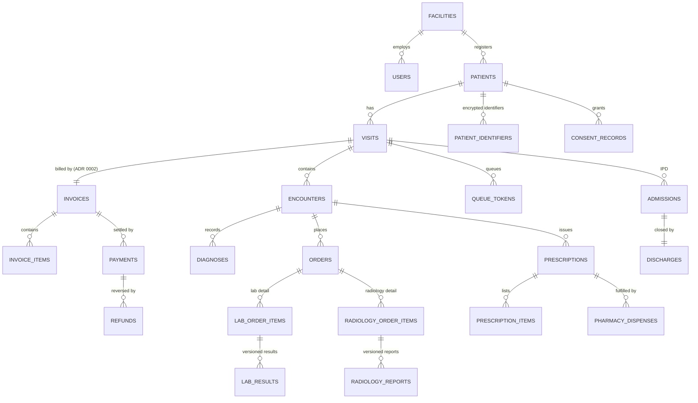

# HealthDoc Master Database Schema

## About this document

HealthDoc is a Hospital Information Management System (HMIS) for India's public health
network — ABDM V3-ready, DPDP-compliant, and built as an offline-resilient hybrid
edge-cloud system. This document defines the complete PostgreSQL schema that all seven
backend developers build against: every table, every column, every migration number,
and the API field contract between backend and frontend. How the modules connect and
flow at runtime is in `docs/architecture.html`; on conflicts: ADRs → this document →
architecture.html.

**Audience:** backend devs (B1–B7) writing migrations and modules; frontend devs (F1–F6)
consuming the API shapes in §4; reviewers checking migration PRs.

**How to read it:** §1 lists the five rules most drafts broke — read it first. §2 is the
migration map (who builds what, in which order). §3 is the table-by-table definition.
§4 is the API field contract. §5 is a personal fix list per developer. §6 is the build
dependency chain. §7 summarizes how sensitive data is protected. `§` means "section of
this document".

### Revision history

| Version | Date | Change |
|---|---|---|
| v1 | 2026-07-16 | Consolidation of the seven developer schema drafts |
| v2 | 2026-07-17 | ADR 0002: full departmental billing replaces registration-payment model; users table extended |
| v2.1 | 2026-07-17 | Review hardening: mobile varchar(20), enum widths varchar(30), FK + audit indexes, single versioning pattern, 0018 retired |
| v2.2 | 2026-07-17 | Security pass: crypto key_version on patient_identifiers, PII rules for notification payloads and error messages, page_size cap, retention notes; synced with architecture.html |
| v3.4.1 | 2026-07-21 | Precision pass: invoice trigger frozen/mutable column lists, enum width rule → varchar(50), uhid NULL-unique note, no-FK-to-audit policy, facility_modules seeding, self-approval 409, UUID-only URL params; v3.5 backlog recorded |
| v3.4 | 2026-07-20 | Account governance: superadmin role (cloud-only, no clinical access), user_account_requests maker-checker (0028), documented /users, /audit/*, /reports/kpis endpoint contracts |
| v3.3 | 2026-07-20 | Facility module toggles (0027): per-hospital on/off for lab/radiology/pharmacy/IPD/OT/…, external-referral fulfilment on orders, capabilities endpoint; billing invariant unchanged |
| v3.2 | 2026-07-20 | ICD-11 promoted into MVP: WHO ICD-API container in compose, backend client + catalog seeder, diagnosis search endpoint contract |
| v3 | 2026-07-20 | Compliance wave (DPDP Rules 2025 + NABH DHS 2nd Ed): migrations 0021–0026 — DPO/grievances/breach log, consent managers, guardian verification, vitals & nursing, procurement, HR/KPI, FHIR transaction log; index strategy §3-end |

### Glossary

| Term | Meaning |
|---|---|
| ABDM | Ayushman Bharat Digital Mission — India's national digital health ecosystem (Gateway V3) |
| ABHA | Ayushman Bharat Health Account — patient's national health ID |
| UHID | Unique Hospital Identifier — permanent patient ID issued by HealthDoc |
| THID | Temporary Hospital ID — for unidentified/emergency patients, later merged into a UHID |
| DPDP | Digital Personal Data Protection Act, 2023 (India) — governs personal data handling |
| HFR | Health Facility Registry (ABDM) |
| FEFO | First-Expiry-First-Out — batch picking order for pharmacy stock |
| GRN | Goods Received Note — inventory receiving record |
| DAMA | Discharge Against Medical Advice |
| LWBS | Left Without Being Seen (OPD visit outcome) |
| OPD / IPD | Out-Patient / In-Patient Department |
| OT | Operating Theatre |
| PACS | Picture Archiving and Communication System (Orthanc, DICOM imaging) |
| Blind index | Deterministic HMAC of an identifier used for lookups without storing plaintext |
| DPDP Rules 2025 | The notified rules operationalizing the DPDP Act — breach intimation, DPO, consent managers, grievances |
| DPB | Data Protection Board of India — breach reports and grievance escalations go here |
| SDF | Significant Data Fiduciary — designation that triggers DPO + DPIA + annual audit duties |
| NABH DHS | NABH Digital Health Standards for Hospitals, 2nd Edition (Sept 2025) |

**Status: binding.** This is the single source of truth for every table, every migration
number, and every API field name. It consolidates the seven schema drafts submitted by
the team (Aditya, Khushi ×2, Priyanshu, Riya, Suprita, Vani), reconciled against
`docs/schema-conventions.md`. Where your draft differs from this document, **this
document wins** — your personal fix list is in §5.

Rules of engagement:

- Build exactly the tables in §3, with exactly these column names.
- Enum values come from `backend/app/common/enums.py` — already updated to match §3.
- Migration numbers and chain order come from §2. Do not renumber.
- API JSON field names = column names (snake_case), wrapped in the standard envelope (§4).
- Any change to this file = PR + Tech Lead review, same as `schema-conventions.md`.

---

## 1. The five global corrections (read first — most drafts break these)

1. **The primary key of every table is `id UUID`.** It is *never* called `uhid`,
   `order_id`, `item_id`, `donor_id`, or anything else. `uhid` is a *business
   identifier of a patient* — it exists as a unique column on `patients` only.
   Foreign keys always point at `<table>.id`, never at `uhid` or any business number.
2. **No integer / SERIAL primary keys anywhere.** Offline facilities sync to cloud;
   integer sequences collide. UUID via `uuid_generate_v4()` (use the `UUIDPk` mixin).
3. **`timestamptz` everywhere** (UTC). Never bare `TIMESTAMP`.
4. **Status values are lowercase snake_case from `enums.py`.** Not `'Pending'`,
   not `'Full Dispense'`, not `'OPD'`. Every status column gets a named CHECK
   constraint: `CheckConstraint(EnumClass.sql_check("status"), name="ck_<table>_status")`.
5. **People are `users.id` (UUID).** No `doctor_id INT`, no separate `doctor` table,
   no `staff_id INT`. Doctors, nurses, receptionists are all rows in `users`; role
   lives in Keycloak. Departments are `department_id UUID → departments.id`, never a
   varchar department name.

## 2. Migration map — numbers, owners, chain

Files: `backend/migrations/versions/<NNNN>_<slug>.py`, `revision = "<NNNN>"` (4-digit,
zero-padded — the issues say "005", the file and revision string say `0005`).
`down_revision` = the previous number in this table. **This chain is the build order;
do not merge out of order.**

| Rev | Slug | Tables | Owner (issue) |
|---|---|---|---|
| 0001 | extensions | uuid-ossp, pgcrypto, pg_trgm | B1 — merged ✅ |
| 0002 | facilities_users | facilities, users | B1 |
| 0003 | audit | audit_logs, audit_log_archive, audit_integrity_checks | B7 (B7-W1-01) |
| 0004 | consent | consent_purposes, consent_records, consent_withdrawals, data_access_log, consent_renewal_reminders | B7 (B7-W1-02) |
| 0005 | departments_rooms | departments, rooms | B4 (B4-W1-01) |
| 0006 | patients | patients, patient_identifiers, patient_merge_log | B2 (B2-W1-01) |
| 0007 | visits_encounters | visits, encounters, icd_codes, diagnoses | B3 (B3-W1-01) |
| 0008 | orders_prescriptions | orders, prescriptions, prescription_items | B3 (B3-W1-01) |
| 0009 | rosters_queues | rosters, queues, queue_tokens | B4 (B4-W1-01) |
| 0010 | lab | lab_order_items, lab_results | B5 (B5-W1-01) |
| 0011 | radiology | radiology_order_items, radiology_reports | B5 (B5-W1-01) |
| 0012 | inventory | suppliers, inventory_items, stock_locations, inventory_batches, stock_ledger (+ FK prescription_items→inventory_items) | B6 (B6-W1-01) |
| 0013 | pharmacy | pharmacy_dispenses, pharmacy_dispense_items, grn, grn_items, indents, indent_items, adjustments, facility_settings | B6 (B6-W1-01) |
| 0014 | billing | invoices, invoice_items, payments, refunds, billing_counters | B7 (B7-W1-03 — **ADR 0002: full departmental billing**) |
| 0015 | admissions_discharge | wards, beds, admissions, discharges | B3 (B3-W1-01) |
| 0016 | blood_bank | blood_donors, blood_units | B5 (B5-W1-02, schema only) |
| 0017 | ot_stubs | ot_schedules, ot_records | B3 (B3-W1-02, schema only) |
| 0018 | — skipped, never create — | | |
| 0019 | files | files, file_access_log | B7 (B7-W1-03) — `down_revision = "0017"` |
| 0020 | notifications | notification_history | B4 (B4-W1-01) |
| 0021 | dpdp_compliance | data_protection_officers, patient_grievances, data_breach_notifications, consent_managers (+ FK consent_records.consent_manager_id) | B7 (W3) |
| 0022 | guardian_verification | ALTER patients: is_minor, guardian_verified, guardian_verification_method | B2 (W3) |
| 0023 | vitals_nursing | vitals, nursing_handover_notes, intake_output_records, patient_movement_log | B3 (W5) |
| 0024 | procurement | purchase_orders, purchase_order_items, stock_transfers, stock_transfer_items, machine_maintenance_logs (+ adjustments.adjustment_type) | B6 (W4) |
| 0025 | hr_kpi | staff_certifications, staff_training_records, kpi_snapshots | B1 (W5) |
| 0026 | fhir_notifications | fhir_bundle_transactions, discharge_notifications | B7 + B4 (W6) |
| 0027 | facility_modules | facility_modules (+ orders.fulfilment_mode) | B1 (W3) |
| 0028 | user_account_requests | user_account_requests | B1 (W3) |

Because you're working in parallel: if the previous migration isn't merged yet, set
`down_revision` to its number anyway and coordinate merge order in the team channel.
CI runs `alembic upgrade head` — a broken chain fails the PR.

**About 0018:** Alembic revision ids are labels, not a sequence — `0019.down_revision
= "0017"` is a perfectly linear chain. The number 0018 is retired: **nobody may ever
create a revision `0018`** (it would fork the history into two heads and break every
environment). New migrations after 0020 take 0021, 0022, ...

## 3. Canonical table definitions

Notation: every table implicitly starts with
`id UUID PK DEFAULT uuid_generate_v4()` and ends with
`created_at / updated_at timestamptz NOT NULL DEFAULT now()` (the `UUIDPk` +
`Timestamps` mixins). `[Blame]` = also has `created_by UUID NOT NULL → users.id`,
`updated_by UUID NULL → users.id`. Only the *other* columns are listed.
`→` means FK to that table's `id`. All FKs `ON DELETE RESTRICT` unless stated.

Two blanket rules (they override anything narrower shown inline):

- **Enum-backed columns** (status, type, mode, priority, category, path, channel) are
  always `varchar(50)` — this rule OVERRIDES any narrower width shown inline in §3.
  Values are CHECK-constrained strings; tight widths truncate silently when a
  vocabulary grows (`doctor_approval_required` is already 24 chars). Free-form
  identifier columns from external systems (`consent_artefact_id`, ICD URIs,
  `post_coordinated_code`) are `text`; `pacs_study_uid` is `varchar(100)`.
- **Every FK column gets an index** `ix_<table>_<col>` unless it is already the leading
  column of a unique or compound index. Postgres does NOT index FK columns automatically;
  unindexed FKs cause sequential scans on patient-history reads and slow RESTRICT checks.

### Entity relationship overview

The core clinical flow at a glance (identity → visit → clinical work → billing).
Detail tables (versioned results, items, logs) hang off these spines and are defined
in the sections below.



*Figure 1 — conceptual ER diagram of the core entities. Renders on GitHub; the docx
version embeds it as an image.*

### 0002 — facilities, users (B1)

**facilities**
```
code            varchar(20) UNIQUE NOT NULL      -- e.g. JPR001, used inside UHID
name            text NOT NULL
state_code      varchar(5) NOT NULL              -- e.g. RJ
district        text
facility_type   varchar(30)                      -- phc | chc | district_hospital | medical_college
hfr_facility_id varchar(50)                      -- ABDM Health Facility Registry id
is_active       boolean NOT NULL DEFAULT true
```

**users** (credentials live in Keycloak — this row is the app-side profile)
```
keycloak_sub    varchar(64) UNIQUE NOT NULL      -- Keycloak subject; JWT 'sub' maps here
username        varchar(100) UNIQUE NOT NULL
full_name       text NOT NULL
email           varchar(255)
mobile          varchar(20)                      -- E.164 (+15 digits max, incl. leading +)
designation     varchar(100)                     -- display only; authz = Keycloak roles
employee_id     varchar(30) NULL                 -- hospital HR id; UNIQUE (facility_id, employee_id)
registration_number varchar(50) NULL             -- medical council reg no (doctors)
qualification   varchar(100) NULL
facility_id     UUID NOT NULL → facilities
is_active       boolean NOT NULL DEFAULT true
```
(`department_id UUID NULL → departments` is added by migration 0005 via `op.add_column`,
since departments doesn't exist yet at 0002.)

### 0003 — audit (B7, Vani's design adopted with renames)

**audit_logs** — append-only, hash-chained, partitioned monthly by `created_at`
(PK is `(id, created_at)` because of partitioning). Trigger `trg_audit_logs_block_update`
rejects UPDATE/DELETE. No `updated_at` on append-only tables.
**Policy: no table may foreign-key to `audit_logs.id`** — its PK is `(id, created_at)`
(partitioned) and partitions get archived; reference audit rows by value, never by FK.
```
facility_id     UUID NOT NULL → facilities       -- (was hospital_id in draft)
user_id         UUID NULL → users
role            text
department_id   UUID NULL                        -- FK constraint added in 0005
action          text NOT NULL                    -- create | update | merge | login | ...
resource_type   text NOT NULL                    -- table/module name
resource_id     UUID
patient_id      UUID NULL                        -- FK added in 0006
visit_id        UUID NULL                        -- FK added in 0007
old_value       jsonb
new_value       jsonb
reason          text
ip_address      inet
device_id       text
prev_hash       char(64)
entry_hash      char(64) NOT NULL                -- sha256(prev_hash + payload), trigger-computed
signature       text NOT NULL                    -- Ed25519, app-signed
signer_key_id   text NOT NULL
INDEX ix_audit_logs_user_id (user_id, created_at)        -- partitioned index
INDEX ix_audit_logs_patient_id (patient_id, created_at)  -- partitioned index
INDEX ix_audit_logs_resource (resource_type, resource_id)
```
Partitioning only prunes by time — per-user / per-patient audit trails need these
indexes (created on the partitioned parent, so each monthly partition inherits them).

**audit_log_archive** `[no Blame]`
```
facility_id UUID NOT NULL → facilities · partition_name text · period_start date ·
period_end date · row_count bigint · object_storage_bucket text · object_storage_key text ·
archive_file_hash char(64) · archived_at timestamptz · verified_at timestamptz ·
verification_status varchar(30) CHECK pending|verified|failed
```

**audit_integrity_checks**
```
facility_id UUID NOT NULL → facilities · partition_name text · checked_at timestamptz ·
rows_checked bigint · chain_valid boolean · signatures_valid bigint ·
signatures_invalid bigint · first_mismatch_id UUID · alerted boolean DEFAULT false
```

### 0004 — consent (B7)

**consent_purposes**
```
purpose_code    varchar(50) UNIQUE NOT NULL
description     text
default_expiry_days int
requires_explicit_consent boolean NOT NULL DEFAULT true
is_active       boolean NOT NULL DEFAULT true
```

**consent_records** `[Blame]` — immutable after insert except `status`, `status_changed_at`
```
patient_id      UUID NOT NULL                    -- FK added in 0006
visit_id        UUID NULL                        -- FK added in 0007
purpose_id      UUID NOT NULL → consent_purposes
granted_by_type varchar(30) CHECK patient|guardian|nominee
granted_by_user_id UUID NULL → users
guardian_name   text
guardian_relationship varchar(50)
guardian_id_proof_file_id UUID NULL              -- FK added in 0019
granted_at      timestamptz
expires_at      timestamptz NULL                 -- NULLABLE per issue spec
scope           text[]
channel         varchar(30) CHECK verbal|written|digital_otp|abdm_consent_manager
consent_artefact_id text
consent_artefact_signature text
status          varchar(30) NOT NULL DEFAULT 'granted'   -- ConsentStatus enum
status_changed_at timestamptz
```

**consent_withdrawals** — append-only; insert flips parent `consent_records.status → revoked`
```
consent_id UUID NOT NULL → consent_records ·
withdrawn_by_type varchar(30) CHECK patient|guardian|nominee|system_expiry ·
withdrawn_by_user_id UUID NULL → users · withdrawn_at timestamptz · reason text ·
cascaded_actions jsonb · cascade_deadline timestamptz · cascade_completed_at timestamptz
```

**data_access_log** — append-only, partitioned monthly by `accessed_at`, PK `(id, accessed_at)`
```
consent_id UUID NULL → consent_records · user_id UUID NOT NULL → users · role text ·
resource_type text · resource_id UUID · patient_id UUID NULL · purpose_code varchar(50) ·
access_channel varchar(30) CHECK ui|api|abdm_hiu|export ·
emergency_access boolean NOT NULL DEFAULT false ·         -- break-glass flag
consent_required boolean · consent_verified boolean · accessed_at timestamptz NOT NULL
INDEX ix_data_access_log_user_id (user_id, accessed_at) ·
INDEX ix_data_access_log_patient_id (patient_id, accessed_at)
```

**consent_renewal_reminders**
```
consent_id UUID NOT NULL → consent_records · remind_at timestamptz · sent_at timestamptz ·
notification_channel varchar(30)
```

### 0005 — departments, rooms (B4)

**departments**
```
name        text NOT NULL
code        varchar(20) UNIQUE NOT NULL          -- used in token numbers, e.g. MED
facility_id UUID NOT NULL → facilities
is_active   boolean NOT NULL DEFAULT true
```

**rooms**
```
department_id UUID NOT NULL → departments
room_number   varchar(30) NOT NULL
is_active     boolean NOT NULL DEFAULT true
UNIQUE (department_id, room_number)              -- unique per department, not global
```
Also in 0005: `op.add_column("users", department_id UUID NULL → departments)` and the
deferred FK on `audit_logs.department_id`.

### 0006 — patients (B2, Priyanshu's design adopted)

**patients** `[Blame]`
```
uhid            varchar(30) UNIQUE NULL          -- IN-RJ-JPR001-2026-000042-7; NULL only while THID
thid            varchar(25) UNIQUE NULL          -- TH-JPR001-260714-0007; emergency path
full_name       text NOT NULL
sex             varchar(30) NOT NULL             -- Sex enum
dob             date NULL
age_years       int NULL
   CHECK (dob IS NOT NULL OR age_years IS NOT NULL)  -- ck_patients_dob_or_age
guardian_name   text
guardian_relationship varchar(50)
mobile          varchar(20)                      -- contact only, NEVER identity
address_line    text · village_town text · district text · state_code varchar(5) · pincode varchar(6)
photo_file_id   UUID NULL                        -- MinIO ref via files (FK added 0019); photo mandatory per ADR 0001
abha_number     varchar(17) UNIQUE NULL
identity_path   varchar(30) NOT NULL             -- IdentityPath enum (ADR 0001)
identity_status varchar(30) NOT NULL DEFAULT 'verified'  -- IdentityStatus enum
status          varchar(30) NOT NULL DEFAULT 'active'    -- PatientStatus: active|merged|deceased
merged_into_patient_id UUID NULL → patients
facility_id     UUID NOT NULL → facilities
deleted_at      timestamptz NULL · deleted_by UUID NULL → users
INDEX ix_patients_full_name_trgm  USING gin (full_name gin_trgm_ops)
UNIQUE INDEX uq_patients_uhid ON (uhid) WHERE deleted_at IS NULL
-- NULLs are distinct in Postgres unique indexes — INTENDED: many THID-only patients
-- coexist with uhid NULL until their supervisor-approved merge assigns one.
CHECK (uhid IS NOT NULL OR thid IS NOT NULL)     -- ck_patients_has_identifier
```

**patient_identifiers**
```
patient_id      UUID NOT NULL → patients
identifier_type varchar(30) NOT NULL             -- aadhaar | abha | voter_id | other
identifier_value_encrypted bytea NOT NULL        -- AES-256-GCM, app-layer, never queried
identifier_blind_index char(64) NOT NULL         -- HMAC-SHA256; THE dedup lookup column
key_version     smallint NOT NULL DEFAULT 1      -- which crypto key pair produced this row;
                                                 -- enables key rotation without a big-bang re-encrypt
verified        boolean NOT NULL DEFAULT false
captured_at     timestamptz · captured_by UUID → users
UNIQUE (patient_id, identifier_type)
INDEX ix_patient_identifiers_blind_index (identifier_blind_index)
```
Two env keys: one for AES, one for HMAC — never the same key (see Priyanshu's doc §Week 1;
implementation lands in `common/security.py`, B2-W1-03). **Key rotation:** keys are
versioned; new writes use the newest `key_version`, lookups compute the blind index under
every active version until a background re-index completes. Keys live in env/secret
manager only — never in the DB, never in the repo.

**patient_merge_log** — append-only (status changes = new rows)
```
source_type varchar(30) NOT NULL                 -- thid | duplicate_uhid
source_patient_id UUID NOT NULL → patients
target_patient_id UUID NOT NULL → patients
requested_by UUID NOT NULL → users · requested_at timestamptz NOT NULL
approved_by UUID NULL → users · approved_at timestamptz
status varchar(30) NOT NULL                      -- pending | approved | rejected | unmerged
reason text · unmerge_reason text
before_snapshot jsonb NOT NULL · after_snapshot jsonb
```

### 0007 — visits, encounters, diagnoses (B3)

**visits** `[Blame]`
```
visit_number  varchar(30) UNIQUE NOT NULL        -- VST-<FACILITYCODE>-<YYYYMMDD>-<SEQ5>
patient_id    UUID NOT NULL → patients
facility_id   UUID NOT NULL → facilities
department_id UUID NULL → departments
visit_type    varchar(30) NOT NULL               -- VisitType enum: opd|ipd|emergency|teleconsult
status        varchar(30) NOT NULL DEFAULT 'registered'  -- VisitStatus enum
visit_date    timestamptz NOT NULL
INDEX ix_visits_patient_id_visit_date (patient_id, visit_date)
```

**encounters** `[Blame]`
```
visit_id        UUID NOT NULL → visits
provider_user_id UUID NOT NULL → users           -- the doctor
encounter_type  varchar(30)                      -- consultation | follow_up | emergency | ward_round
chief_complaint text
started_at      timestamptz · ended_at timestamptz
INDEX ix_encounters_visit_id (visit_id) · INDEX ix_encounters_provider_user_id (provider_user_id)
```
Long-form clinical notes go to **Mongo `clinical_notes`** (keyed by `encounter_id`),
not a text column here.

**icd_codes** — local ICD catalog (seeded ICD-10 now; ICD-11 rows sync in Phase 2)
```
version        varchar(30) NOT NULL              -- icd10 | icd11
code           varchar(30) NOT NULL              -- 'E11' or ICD-11 stem '5A11'
title          text NOT NULL
icd_uri        text NULL                         -- ICD-11 Foundation URI (permanent even if code changes)
is_postcoordinable boolean NOT NULL DEFAULT false
is_active      boolean NOT NULL DEFAULT true
UNIQUE (version, code) · INDEX ix_icd_codes_icd_uri (icd_uri)
```

**diagnoses** `[Blame]` — ICD-11-ready from day one (columns nullable until Phase 2)
```
encounter_id   UUID NOT NULL → encounters
icd_code       varchar(30) NOT NULL              -- stem code
icd_version    varchar(30) NOT NULL              -- icd10 | icd11
icd_code_id    UUID NULL → icd_codes             -- catalog link when picked from catalog
icd_uri        text NULL                         -- ICD-11 Foundation URI
post_coordinated_code text NULL                  -- full cluster, e.g. '5A11&XS0T' (ICD-11 only)
diagnosis_text text NOT NULL
diagnosis_type varchar(30) NOT NULL              -- provisional | final | differential
is_primary     boolean NOT NULL DEFAULT false
INDEX ix_diagnoses_icd_code_icd_version (icd_code, icd_version)
```

> **ICD-11 in the MVP:** the WHO ICD-API container (`icd11` service) is part of the
> compose stack — diagnosis search works offline at the facility edge. Doctors code in
> ICD-11 (stem + optional post-coordination cluster) with ICD-10 still accepted for
> continuity; every selection is upserted into `icd_codes` for offline re-display.
> Backend client: `app/integrations/icd11/client.py`; catalog seeding:
> `backend/scripts/seed_icd_codes.py` (WHO MMS SimpleTabulation release file).
> Phase 2 adds only the WHO Embedded Coding Tool UI polish and an
> `icd_procedure_mappings` table (ICD URI → suggested PM-JAY/HBP packages like MO031A —
> suggestions only, never auto-ordering).

### 0008 — orders, prescriptions (B3)

**orders** `[Blame]` — the single order header for *all* departments. Lab/radiology add
their detail rows in 0010/0011 pointing back here. Fulfilment is not payment-gated;
completed chargeable work accrues lines onto the visit invoice (ADR 0002).
```
order_number varchar(30) UNIQUE NOT NULL         -- ORD-<YYYYMMDD>-<SEQ6>
encounter_id UUID NOT NULL → encounters
patient_id   UUID NOT NULL → patients
order_type   varchar(30) NOT NULL                -- lab | radiology | pharmacy | procedure | blood
priority     varchar(30) NOT NULL DEFAULT 'routine'  -- routine | urgent | stat
status       varchar(30) NOT NULL DEFAULT 'placed'   -- OrderStatus enum
ordered_at   timestamptz NOT NULL DEFAULT now()
INDEX ix_orders_order_type_status (order_type, status)
INDEX ix_orders_patient_id (patient_id) · INDEX ix_orders_encounter_id (encounter_id)
```

**prescriptions** `[Blame]` — header; drugs are items (one row per drug, not one big text)
```
encounter_id UUID NOT NULL → encounters
patient_id   UUID NOT NULL → patients
notes        text
```

**prescription_items**
```
prescription_id UUID NOT NULL → prescriptions ON DELETE CASCADE
medicine_item_id UUID NULL                       -- → inventory_items, FK added in 0012
medicine_name   text NOT NULL                    -- free-text fallback / snapshot of name
dosage varchar(50) · frequency varchar(50) · duration_days int · route varchar(30)
instructions text
status varchar(30) NOT NULL DEFAULT 'prescribed' -- PrescriptionItemStatus enum
INDEX ix_prescription_items_prescription_id (prescription_id)
```

### 0009 — rosters, queues, queue_tokens (B4, Suprita's design + parent queues table)

**rosters**
```
staff_user_id UUID NOT NULL → users
department_id UUID NOT NULL → departments
room_id       UUID NULL → rooms
shift         varchar(30) NOT NULL               -- morning | evening | night
roster_date   date NOT NULL
is_available  boolean NOT NULL DEFAULT true
UNIQUE (staff_user_id, roster_date, shift)
```

**queues** — one row per doctor per department per day
```
department_id  UUID NOT NULL → departments
doctor_user_id UUID NOT NULL → users
service_date   date NOT NULL
UNIQUE (department_id, doctor_user_id, service_date)
```

**queue_tokens**
```
queue_id     UUID NOT NULL → queues
visit_id     UUID NULL → visits
sequence     int NOT NULL                        -- allocated per queue, race-safe (advisory lock or counters row)
token_display varchar(20) NOT NULL               -- what screens show: <DEPT_CODE>-<SEQ3>, e.g. MED-042
status       varchar(30) NOT NULL DEFAULT 'waiting'   -- QueueTokenStatus enum (incl. skipped/recalled/transferred)
priority     varchar(30) NOT NULL DEFAULT 'normal'    -- QueuePriority enum
called_at    timestamptz · completed_at timestamptz
UNIQUE (queue_id, sequence)                      -- NOT a global unique token string
```
Priority sort (high→low): `emergency, doctor_recall, admin_override, senior_citizen,
pregnant, follow_up_recall, normal`; ties by `created_at` ascending.

### 0010 / 0011 — lab, radiology (B5)

Lab and radiology do **not** have their own order-header tables — the header is
`orders` (0008). These are detail + result tables.

**lab_order_items** `[Blame]`
```
order_id        UUID NOT NULL → orders           -- order.order_type = 'lab'
accession_number varchar(30) UNIQUE NOT NULL     -- LAB-<YYYYMMDD>-<SEQ5>
test_code varchar(30) · test_name text NOT NULL
sample_type varchar(30) NOT NULL
department_id UUID NULL → departments
status varchar(30) NOT NULL DEFAULT 'placed'     -- OrderStatus enum
estimated_minutes int
```

**lab_results** — append-only, versioned (corrections = new row)
```
lab_order_item_id UUID NOT NULL → lab_order_items
version     int NOT NULL                         -- 1, 2, 3...
is_current  boolean NOT NULL
result_data jsonb NOT NULL
remarks     text
status      varchar(30) NOT NULL                 -- ResultStatus: pending|preliminary|final|corrected
created_by  UUID NOT NULL → users
UNIQUE (lab_order_item_id, version)
UNIQUE INDEX uq_lab_results_current ON (lab_order_item_id) WHERE is_current
```

**radiology_order_items** `[Blame]`
```
order_id UUID NOT NULL → orders                  -- order.order_type = 'radiology'
accession_number varchar(30) UNIQUE NOT NULL     -- RAD-<YYYYMMDD>-<SEQ5>
modality varchar(30) NOT NULL                    -- xray | ct | mri | usg | mammo
scan_type text NOT NULL
machine_id varchar(50)
pacs_study_uid varchar(100)                      -- Orthanc StudyInstanceUID
scheduled_at timestamptz
status varchar(30) NOT NULL DEFAULT 'placed'
```

**radiology_reports** — append-only, versioned; same shape as lab_results but
`findings text` + `impression text` instead of `result_data`.

### 0012 / 0013 — inventory, pharmacy (B6, Riya's design adopted with fixes)

**suppliers** — `name text NOT NULL · contact_info text · is_active bool DEFAULT true`

**inventory_items**
```
name text NOT NULL · generic_name text · strength varchar(50)
form varchar(30)        -- tablet|capsule|injection|syrup|ointment|fluid|reagent|consumable|film|implant|blood_component
item_type varchar(30)   -- medicine|reagent|consumable|film|implant|blood_component
is_controlled_drug boolean NOT NULL DEFAULT false
manufacturer text
owning_department_id UUID NULL → departments
reorder_level numeric(12,2) NOT NULL DEFAULT 0
is_active boolean NOT NULL DEFAULT true
```

**stock_locations**
```
name text NOT NULL
location_type varchar(30)   -- central|pharmacy|lab|radiology|ward|emergency|ot
department_id UUID NULL → departments
facility_id UUID NOT NULL → facilities
```

**inventory_batches**
```
item_id UUID NOT NULL → inventory_items
batch_number varchar(50) NOT NULL
expiry_date date NOT NULL                        -- NO CHECK against CURRENT_DATE (Riya: that
                                                 -- check breaks old rows; expiry is a query/logic concern)
quantity numeric(12,2) NOT NULL CHECK (quantity >= 0)
purchase_rate numeric(12,2) · issue_rate_mrp numeric(12,2)
stock_location_id UUID NOT NULL → stock_locations
UNIQUE (item_id, batch_number, stock_location_id)
INDEX ix_inventory_batches_fefo ON (item_id, expiry_date ASC) WHERE quantity > 0
```

**stock_ledger** — append-only (issue wording; was `stock_transactions` in draft)
```
item_id UUID NOT NULL → inventory_items · batch_id UUID NULL → inventory_batches
transaction_type varchar(30) NOT NULL            -- purchase|issue|return|transfer|consumption|adjustment|write_off
quantity numeric(12,2) NOT NULL CHECK (quantity <> 0)   -- signed: +in / -out
reference_type varchar(30) · reference_id UUID   -- e.g. 'pharmacy_dispense', 'grn'
performed_by UUID NOT NULL → users · reason text
```

**pharmacy_dispenses** — versioned with the SAME pattern as lab_results/radiology_reports
(one versioning pattern project-wide: `version` int + `is_current` partial unique;
no `previous_version_id` — the previous row is simply `version - 1`)
```
prescription_id UUID NOT NULL → prescriptions
visit_id UUID NULL → visits
status varchar(30) NOT NULL                      -- DispenseStatus enum (§enums)
dispensed_by UUID NOT NULL → users
version int NOT NULL · is_current boolean NOT NULL
UNIQUE (prescription_id, version)
UNIQUE INDEX uq_pharmacy_dispenses_current ON (prescription_id) WHERE is_current
```

**pharmacy_dispense_items**
```
dispense_id UUID NOT NULL → pharmacy_dispenses ON DELETE CASCADE
prescription_item_id UUID NOT NULL → prescription_items
batch_id UUID NOT NULL → inventory_batches
quantity_prescribed numeric(12,2) · quantity_dispensed numeric(12,2)
is_substitute boolean NOT NULL DEFAULT false · substitute_reason text
```

**grn** `[Blame]` — `supplier_id → suppliers · invoice_number varchar(50) · received_date date NOT NULL · status varchar(30) (draft|received|verified|cancelled)`
**grn_items** — `grn_id → grn CASCADE · item_id → inventory_items · batch_number · expiry_date · quantity numeric CHECK (>0) · unit_price numeric(12,2)`
**indents** `[Blame]` — `department_id → departments · status varchar(30) (requested|approved|rejected|issued) · approved_by UUID NULL → users`
**indent_items** — `indent_id → indents CASCADE · item_id → inventory_items · quantity_requested numeric CHECK (>0)`
**adjustments** `[Blame]` — dual sign-off:
```
item_id → inventory_items · batch_id → inventory_batches
quantity_change numeric(12,2) NOT NULL CHECK (<> 0) · reason text NOT NULL
first_approver_id UUID NOT NULL → users · second_approver_id UUID NULL → users
status varchar(30) NOT NULL                      -- pending|approved|rejected
CHECK (first_approver_id <> second_approver_id)  -- ck_adjustments_distinct_approvers
```
**facility_settings** (was `hospital_settings`) — `facility_id UUID PK → facilities · stock_deduction_policy varchar(30) CHECK on_acceptance|on_dispense`

> Riya's draft table 14 (`audit_logs`) is **dropped** — audit is owned by B7/Vani
> (migration 0003). Inventory mutations write through the shared audit middleware.

### 0014 — billing (B7 — ADR 0002: full departmental billing)

**invoices** `[Blame]` — one per visit, created at registration with the registration-fee
line; departments append lines as chargeable work completes. CRITICAL sync sensitivity.
An **immutability trigger** (`trg_invoices_freeze`) applies once `status != 'draft'`:
**frozen columns** = `invoice_number, visit_id, patient_id, facility_id, gross_amount,
discount_amount, scheme_adjustment, net_amount, scheme_code`.
**Always mutable** = `status, updated_at, updated_by` — payment posting MUST be able to
move `issued → partially_paid → paid`; the trigger checks column changes, not row
updates. Corrections happen by `cancelled` + new invoice, never edits. B7: unit-test
that a payment can flip status on an issued invoice before merging 0014.
```
invoice_number varchar(30) UNIQUE NOT NULL       -- INV-<FACILITY>-<YYYYMMDD>-<SEQ5>, gapless
visit_id UUID NOT NULL → visits
patient_id UUID NOT NULL → patients
facility_id UUID NOT NULL → facilities
status varchar(30) NOT NULL DEFAULT 'draft'      -- InvoiceStatus: draft|issued|partially_paid|paid|waived|cancelled
gross_amount numeric(12,2) NOT NULL DEFAULT 0
discount_amount numeric(12,2) NOT NULL DEFAULT 0
scheme_adjustment numeric(12,2) NOT NULL DEFAULT 0
net_amount numeric(12,2) NOT NULL DEFAULT 0 CHECK (>= 0)
scheme_code varchar(30) NULL                     -- PM-JAY etc.; full waiver ⇒ status 'waived'
sensitivity varchar(30) NOT NULL DEFAULT 'critical'
INDEX ix_invoices_visit_id (visit_id)
```

**invoice_items** — frozen by the parent's trigger once invoice leaves `draft`
```
invoice_id UUID NOT NULL → invoices
charge_category varchar(30) NOT NULL             -- ChargeCategory: registration|consultation|lab|radiology|pharmacy|procedure|ipd_stay|blood|other
reference_type varchar(30) · reference_id UUID   -- source row: 'lab_order_items', 'admissions', ...
description text NOT NULL
quantity numeric(10,2) NOT NULL DEFAULT 1 CHECK (> 0)
unit_price numeric(12,2) NOT NULL CHECK (>= 0)
amount numeric(12,2) NOT NULL CHECK (>= 0)       -- quantity * unit_price, app-computed
```

**payments** `[Blame]` — partial payments allowed (many per invoice)
```
receipt_number varchar(30) UNIQUE NOT NULL       -- RCP-<FACILITY>-<YYYYMMDD>-<SEQ5>, gapless
invoice_id UUID NOT NULL → invoices
amount numeric(12,2) NOT NULL CHECK (> 0)
currency char(3) NOT NULL DEFAULT 'INR'
mode varchar(30) NOT NULL                        -- PaymentMode: cash|upi|card|netbanking
status varchar(30) NOT NULL DEFAULT 'success'    -- PaymentStatus: success|reversed
collected_by UUID NOT NULL → users · collected_at timestamptz NOT NULL
sensitivity varchar(30) NOT NULL DEFAULT 'critical'
```

**refunds** `[Blame]` — reversal rows only; a refund never edits the payment
```
refund_number varchar(30) UNIQUE NOT NULL        -- RFD-<FACILITY>-<YYYYMMDD>-<SEQ5>
payment_id UUID NOT NULL → payments
amount numeric(12,2) NOT NULL CHECK (> 0)
reason text NOT NULL
approved_by UUID NOT NULL → users · refunded_at timestamptz NOT NULL
```

**billing_counters** — gapless allocator for invoice/receipt/refund numbers:
`facility_id → facilities · counter_type varchar(30) (invoice|receipt|refund) ·
counter_date date · last_value int NOT NULL DEFAULT 0 ·
UNIQUE (facility_id, counter_type, counter_date)`; allocate with
`SELECT ... FOR UPDATE` inside the same transaction (sequences leave gaps on rollback).

### 0015 — wards, beds, admissions, discharges (B3)

**wards** — `name text NOT NULL · department_id UUID NULL → departments · facility_id UUID NOT NULL → facilities · is_active bool`
**beds** — `ward_id UUID NOT NULL → wards · bed_number varchar(20) NOT NULL · status varchar(30) DEFAULT 'vacant' (BedStatus) · UNIQUE (ward_id, bed_number)`

**admissions** `[Blame]` — (Aditya: no ward/room/bed varchars — real FKs)
```
visit_id UUID NOT NULL → visits
patient_id UUID NOT NULL → patients
ward_id UUID NOT NULL → wards · bed_id UUID NOT NULL → beds
admitted_at timestamptz NOT NULL · reason text
status varchar(30) NOT NULL DEFAULT 'admitted'   -- AdmissionStatus enum
```

**discharges** `[Blame]` — table name plural; discharge checks invoice settlement per
facility policy (ADR 0002) but is never hard-blocked for emergency/DAMA cases
```
admission_id UUID UNIQUE NOT NULL → admissions
discharged_at timestamptz NOT NULL
discharge_type varchar(30) NOT NULL              -- discharged|dama|deceased|absconded|transferred
discharge_summary text                           -- long form → Mongo clinical_notes
follow_up_date date NULL
```

### 0016 — blood bank (B5, schema only)

**blood_donors** `[Blame]`
```
patient_id UUID NULL → patients                  -- linked if donor is a registered patient
full_name text NOT NULL · sex varchar(30) · dob date · age_years int
blood_group varchar(30) NOT NULL                  -- BloodGroup enum: a_pos...o_neg
mobile varchar(20) · email varchar(255) · address text
weight_kg numeric(5,2) · hemoglobin_g_dl numeric(4,1)
last_donation_date date · next_eligible_date date
is_eligible boolean NOT NULL DEFAULT false       -- computed in app layer (hb/weight/interval rules), not a DB trigger
remarks text
```

**blood_units**
```
donor_id UUID NOT NULL → blood_donors
bag_number varchar(30) UNIQUE NOT NULL
blood_group varchar(7) NOT NULL
volume_ml int NOT NULL CHECK (> 0)
collected_at timestamptz · expiry_date date NOT NULL
screening_status varchar(30) NOT NULL DEFAULT 'pending'  -- pending|passed|failed
status varchar(30) NOT NULL DEFAULT 'available'          -- BloodUnitStatus enum
issued_to_patient_id UUID NULL → patients
```

### 0017 — OT stubs (B3, schema only)

**ot_schedules** `[Blame]` — `visit_id → visits · patient_id → patients · scheduled_start timestamptz · scheduled_end timestamptz · procedure_name text · status varchar(30) (scheduled|completed|cancelled)`
**ot_records** — `ot_schedule_id → ot_schedules · started_at · ended_at · surgeon_user_id → users · anesthetist_user_id UUID NULL → users · notes text`

### 0019 — files (B7)

**files**
```
bucket varchar(63) NOT NULL · object_key text NOT NULL   -- MinIO location
original_name text · content_type varchar(100) · size_bytes bigint
sha256 char(64)
owner_module varchar(30)                         -- 'patients', 'lab', ...
patient_id UUID NULL → patients
uploaded_by UUID NOT NULL → users
sensitivity varchar(30) NOT NULL DEFAULT 'normal'
UNIQUE (bucket, object_key)
```
Also in 0019: add the deferred FKs — `patients.photo_file_id`,
`consent_records.guardian_id_proof_file_id` → `files.id`.

**file_access_log** — append-only: `file_id → files · user_id → users · action varchar(30) (view|download|upload|delete_attempt) · ip_address inet · accessed_at timestamptz NOT NULL`

### 0020 — notification_history (B4)

```
event_type varchar(50) NOT NULL                  -- token_called, token_status_changed, ...
payload jsonb NOT NULL                           -- jsonb, not json (Suprita draft had json)
department_id UUID NULL → departments
```
Append-only by convention (internal writes only; no update endpoint).
**PII rule:** payloads are shown on public queue displays and kept long-term — they may
contain `token_display`, department/room, and UUIDs, but **never** patient names, UHID,
mobile numbers, or clinical facts.

---


### 0021–0026 — Compliance & operations wave (v3: DPDP Rules 2025 + NABH DHS 2nd Ed)

Verified drivers: DPDP Rules 2025 (notified) — breach intimation to the DPB *without
delay* plus a **detailed report within 72 hours**, affected patients informed without
delay; DPO mandatory once designated a Significant Data Fiduciary. CERT-In separately
requires **6-hour** incident reporting — both timestamps are tracked. NABH DHS 2nd Ed
(Sept 2025) drives vitals capture, discharge notifications, and staff training records.

**data_protection_officers** (0021, B7) `[Blame]`
```
facility_id UUID NOT NULL → facilities · user_id UUID NOT NULL → users
appointed_at timestamptz NOT NULL · contact_published boolean NOT NULL DEFAULT false
published_contact text                            -- what is shown publicly (email/phone)
is_active boolean NOT NULL DEFAULT true
UNIQUE INDEX uq_dpo_active_facility ON (facility_id) WHERE is_active
```

**patient_grievances** (0021, B7) `[Blame]` — DPDP grievance redressal; clock starts at created_at
```
grievance_number varchar(30) UNIQUE NOT NULL      -- GRV-<FACILITY>-<YYYYMMDD>-<SEQ4>
patient_id UUID NOT NULL → patients · facility_id UUID NOT NULL → facilities
grievance_type varchar(30) NOT NULL               -- access|correction|erasure|consent|breach|other
description text NOT NULL
status varchar(30) NOT NULL DEFAULT 'pending'     -- pending|under_review|resolved|escalated_dpb|closed
assigned_to UUID NULL → users · due_at timestamptz NOT NULL   -- created_at + 90 days, app-set
resolution text · resolved_at timestamptz · escalation_reason text
INDEX ix_patient_grievances_status_due_at (status, due_at)
```

**data_breach_notifications** (0021, B7) — append-only after status closes
```
breach_number varchar(30) UNIQUE NOT NULL
detected_at timestamptz NOT NULL
certin_reported_at timestamptz                    -- CERT-In: within 6 hours of noticing
dpb_first_intimation_at timestamptz               -- DPDP: without delay
dpb_detailed_report_at timestamptz                -- DPDP: within 72 h (extension requestable)
patients_notified_at timestamptz                  -- affected Data Principals, without delay
affected_patients_count int
nature text NOT NULL · extent text · mitigation_measures text · root_cause text
status varchar(30) NOT NULL DEFAULT 'open'        -- open|contained|reported|closed
facility_id UUID NOT NULL → facilities
```

**consent_managers** (0021, B7) — DPDP-registered intermediaries / ABDM CMs
```
cm_registration_id varchar(100) UNIQUE NOT NULL · name text NOT NULL
endpoint_url text · is_active boolean NOT NULL DEFAULT true
```
Also in 0021: `ALTER consent_records ADD consent_manager_id UUID NULL → consent_managers`.

**patients additions** (0022, B2)
```
is_minor boolean NOT NULL DEFAULT false           -- set at registration from dob/age_years
guardian_verified boolean NOT NULL DEFAULT false
guardian_verification_method varchar(30) NULL     -- aadhaar|digilocker|manual_document
```
Healthcare exemptions to parental-consent rules still require documentation — that is
what these columns evidence. Guardian name/relationship columns already exist (0006).

**vitals** (0023, B3/nursing) `[Blame]` — NABH structured capture; one row per measurement set
```
encounter_id UUID NULL → encounters · admission_id UUID NULL → admissions
patient_id UUID NOT NULL → patients
measured_at timestamptz NOT NULL
height_cm numeric(5,1) · weight_kg numeric(5,2)
bmi numeric(4,1)                                  -- app-computed on write, never client-supplied
waist_cm numeric(5,1) · hip_cm numeric(5,1) · whr numeric(3,2)   -- app-computed
temp_c numeric(3,1) · pulse_bpm int · resp_rate int
bp_systolic int · bp_diastolic int · spo2_pct int · pain_score smallint
CHECK (encounter_id IS NOT NULL OR admission_id IS NOT NULL)
INDEX ix_vitals_patient_id_measured_at (patient_id, measured_at)
```

**nursing_handover_notes** (0023) `[Blame]` — structured, append-only
```
admission_id UUID NOT NULL → admissions · shift varchar(30) NOT NULL
situation text · background text · assessment text · recommendation text   -- SBAR
handed_over_to UUID NOT NULL → users
```

**intake_output_records** (0023) `[Blame]` — IPD fluid balance
```
admission_id UUID NOT NULL → admissions · recorded_at timestamptz NOT NULL
entry_type varchar(30) NOT NULL                   -- intake_oral|intake_iv|output_urine|output_drain|output_other
volume_ml int NOT NULL CHECK (volume_ml > 0) · notes text
```

**patient_movement_log** (0023) — append-only transfer trail
```
admission_id UUID NOT NULL → admissions
from_ward_id UUID NULL → wards · from_bed_id UUID NULL → beds
to_ward_id UUID NOT NULL → wards · to_bed_id UUID NOT NULL → beds
moved_at timestamptz NOT NULL · reason text · moved_by UUID NOT NULL → users
```

**purchase_orders / purchase_order_items** (0024, B6) `[Blame]` — precede GRN
```
purchase_orders: po_number varchar(30) UNIQUE NOT NULL · supplier_id → suppliers ·
  status varchar(30) (draft|approved|sent|partially_received|received|cancelled) ·
  approved_by UUID NULL → users · expected_date date
purchase_order_items: purchase_order_id → purchase_orders CASCADE · item_id →
  inventory_items · quantity numeric CHECK (>0) · unit_price numeric(12,2)
```
`grn.purchase_order_id UUID NULL → purchase_orders` added in the same migration.

**stock_transfers / stock_transfer_items** (0024, B6) `[Blame]`
```
stock_transfers: from_location_id → stock_locations · to_location_id → stock_locations ·
  status varchar(30) (requested|in_transit|received|cancelled) · CHECK (from ≠ to)
stock_transfer_items: stock_transfer_id CASCADE · item_id · batch_id · quantity CHECK (>0)
```
Each leg writes `stock_ledger` (`transfer` out / in). **Damage write-offs are NOT a new
table** — 0024 adds `adjustments.adjustment_type varchar(30)`
(`damage|expiry|count_error|other`); the dual-signoff flow already covers them.

**machine_maintenance_logs** (0024, B6/B5) `[Blame]` — radiology/lab equipment
```
machine_id varchar(50) NOT NULL · department_id UUID NULL → departments
maintenance_type varchar(30) (preventive|breakdown|calibration|qa_check)
performed_at timestamptz NOT NULL · performed_by_vendor text · downtime_minutes int · notes text
```

**staff_certifications / staff_training_records** (0025, B1) `[Blame]` — NABH HRM
```
staff_certifications: user_id → users · certification_name text NOT NULL ·
  issuing_body text · certificate_file_id UUID NULL → files ·
  issued_on date · valid_until date NULL · INDEX (user_id, valid_until)
staff_training_records: user_id → users · training_name text NOT NULL ·
  training_type varchar(30) (induction|clinical|digital_health|safety|other) ·
  completed_on date NOT NULL · score numeric(5,2) NULL · trainer text
```

**kpi_snapshots** (0025, B1/reports) — computed daily by a job, read by MIS
```
facility_id → facilities · kpi_code varchar(50) NOT NULL   -- avg_opd_wait_minutes, sharp_injury_count, ...
period_start date · period_end date · value numeric(14,4) · numerator numeric · denominator numeric
UNIQUE (facility_id, kpi_code, period_start, period_end)
```

**fhir_bundle_transactions** (0026, B7) — Postgres audit of every ABDM transmission
(payloads stay in Mongo; this row is the auditable fact)
```
bundle_id varchar(100) NOT NULL · abdm_request_id varchar(100)
direction varchar(30) (hip_push|hiu_pull) · care_context_linked boolean
gateway_response_status varchar(30) · signed_by_hpr_id varchar(50)
patient_id UUID NULL → patients · consent_id UUID NULL → consent_records
transmitted_at timestamptz NOT NULL
INDEX ix_fhir_bundle_transactions_patient_id (patient_id, transmitted_at)
```

**discharge_notifications** (0026, B4) — NABH discharge-planning notifications, durable
```
discharge_id UUID NOT NULL → discharges
target_module varchar(30) NOT NULL                -- pharmacy|billing|nursing|lab|radiology|patient
status varchar(30) NOT NULL DEFAULT 'queued'      -- NotificationStatus enum
sent_at timestamptz · acknowledged_at timestamptz · acknowledged_by UUID NULL → users
UNIQUE (discharge_id, target_module)
```

**facility_modules** (0027, B1) — per-hospital module switchboard
```
facility_id UUID NOT NULL → facilities
module_code varchar(30) NOT NULL                 -- ModuleCode enum: lab|radiology|pharmacy|inventory|ipd|ot|blood_bank|emergency|patient_portal|abdm|billing_refunds
is_enabled boolean NOT NULL DEFAULT true
config jsonb NOT NULL DEFAULT '{}'               -- module sub-config, e.g. lab: {"departments": ["PATH","BIO"]}, radiology: {"modalities": ["xray","usg"]}
disabled_reason text
UNIQUE (facility_id, module_code)
```
No row = enabled (default-on) — but **on facility creation the service seeds one row
per ModuleCode with `is_enabled = true`**, so operations always sees explicit rows and
toggling is a plain UPDATE. Default-on is only the safety net for pre-seeding rows.
Changes are admin-only and audited like any mutation.
Core modules can NEVER be disabled: patients, registration, encounters/opd, queue,
departments, billing (invoices/payments), consent, audit, files, users, notifications.

Also in 0027: `ALTER orders ADD fulfilment_mode varchar(30) NOT NULL DEFAULT 'internal'`
(`internal | external_referral`).

### Module toggle behavior — flows bend, never break

The rule everywhere: **disabling a module removes its worklist and its billing accrual,
never the clinical record.**

| Module off | What still works | What changes |
|---|---|---|
| radiology / lab (pathology) | Doctor still records the order (clinical completeness) | Order saved with `fulfilment_mode='external_referral'`; no accession, no worklist entry, no invoice line; printout carries the referral. Lab sub-departments (pathology, biochemistry, microbiology, hematology) are `departments` rows — toggle individually via `config.departments`. |
| pharmacy | Prescriptions still created + printed | No dispense queue, no FEFO/stock movements, no pharmacy invoice lines; items stay `prescribed`. |
| inventory | — | Pharmacy requires inventory; enabling pharmacy with inventory off is a 422 at config time. |
| ipd / ot | OPD, emergency stabilization | No admission/OT endpoints; emergency flow ends in `transferred` with referral note. |
| blood_bank | Ordering `order_type='blood'` as external referral | No donor/unit management. |
| abdm | Registration via Aadhaar/demographics paths | ABHA path hidden; sync jobs idle; nothing queued. |
| patient_portal | Everything internal | Portal login disabled for that facility. |
| billing_refunds | Invoices, payments | Refund endpoints disabled (some facilities route refunds through treasury manually). |

Enforcement (one place each):

- **Backend:** `require_module("radiology")` dependency (like `require_roles`) on every
  module router — disabled ⇒ `409 {"code": "module_disabled", "module": "radiology"}`.
  Order creation validates `order_type` against enabled modules and flips
  `fulfilment_mode` to `external_referral` instead of failing.
- **Frontend:** `GET /api/v1/facility/capabilities` →
  `{"modules": {"lab": true, "radiology": false, ...}, "config": {...}}` — fetched at
  login; navigation, order-type pickers, and dashboards render only enabled modules.
  A 409 `module_disabled` from a stale tab shows "not offered at this facility", not an error page.
- **Billing invariant:** the invoice engine never checks modules — it bills whatever
  lines exist. A disabled module simply never writes lines, so totals stay correct at
  every facility mix. Registration/consultation lines are unaffected.
- **Sync/cloud:** toggles are facility-scoped rows that sync like any master data; the
  cloud MIS sees every facility's mix.

**user_account_requests** (0028, B1) — maker-checker for staff accounts
```
facility_id UUID NOT NULL → facilities
requested_for_full_name text NOT NULL
requested_username varchar(100) NOT NULL
requested_roles text[] NOT NULL                  -- Keycloak realm role names
designation varchar(100) · employee_id varchar(30) · registration_number varchar(50)
qualification varchar(100) · email varchar(255) · mobile varchar(20)
justification text NOT NULL
requested_by UUID NOT NULL → users
status varchar(30) NOT NULL DEFAULT 'pending'    -- ApprovalStatus: pending|approved|rejected
decided_by UUID NULL → users · decided_at timestamptz · rejection_reason text
created_user_id UUID NULL → users                -- set when approval creates the account
INDEX ix_user_account_requests_facility_id_status (facility_id, status)
```

### Account & role governance (v3.4)

- **superadmin** (new Keycloak realm role, cloud-only): creates facilities, appoints
  facility admins and DPOs, sees cross-facility MIS. **Cannot read clinical data** —
  platform ownership and patient care are deliberately separated. The first superadmin
  is seeded at deployment (realm import), the same way dev users are seeded locally.
- **User creation is maker-checker.** Any admin/HOD files a `user_account_requests`
  row; a *different* approver decides (facility admin approves staff; superadmin
  approves facility admins). Nobody approves their own request — enforced in the
  service, evidenced by `requested_by ≠ decided_by`.
- **Approval is atomic:** approving creates the Keycloak account (temporary password,
  requested roles) and the `users` profile row in one flow; failure rolls both back.
  Direct `POST /users` (no request) remains available to admins for bootstrap, and is
  audited like everything else.
- **No self-elevation:** granting `admin` or `superadmin` roles always requires
  superadmin approval; role changes are audit-logged with old/new role lists.

### Index strategy addendum (v3)

- **GIN on jsonb** only where we query inside the document: `lab_results.result_data`
  (`jsonb_path_ops`) and `notification_history.payload`. Do NOT GIN-index
  `audit_logs.old_value/new_value` — write-heavy, queried by the other indexed columns.
- **Partial indexes** for hot subsets: already required for `is_current` and
  `deleted_at IS NULL` uniques; also add `ix_queue_tokens_active ON queue_tokens
  (queue_id, priority, created_at) WHERE status IN ('waiting','called')`.
- **BRIN on `created_at`/`accessed_at`** inside audit/access-log partitions — near-zero
  write cost, fast range scans; partition pruning handles month granularity, BRIN
  handles ranges within a partition.

## 4. API field contract (backend → frontend)

### 4.1 Envelope — every response, no exceptions

```json
{ "success": true, "data": { ... }, "error": null, "meta": { "request_id": "..." } }
{ "success": false, "data": null, "error": { "code": 404, "message": "Patient not found" }, "meta": { "request_id": "..." } }
```
Frontend: always call through `lib/api.ts` — it unwraps `data` and throws `ApiError`.
Backend: return plain dicts/Pydantic models; the middleware wraps them.

### 4.2 Field naming

- JSON keys = DB column names, **snake_case** (`full_name`, not `fullName`). No renaming layer.
- Every resource returns `id` (UUID) **and** its business identifier (`uhid`, `visit_number`, `token_display`, `receipt_number`, `accession_number`...). URLs use `id`; screens display the business identifier.
- Timestamps: ISO-8601 UTC with `Z` (`2026-07-15T09:30:00Z`). Frontend converts to IST for display.
- Enums: exact lowercase values from `enums.py`; the frontend maps them to labels/colors (e.g. `in_service` → "In Consultation").
- Money: `{"amount": "50.00", "currency": "INR"}` — amount as *string* (JSON floats corrupt paise).
- Never in any response: `identifier_value_encrypted`, `identifier_blind_index`, raw Aadhaar, internal file object keys (serve files via presigned URL endpoints).
- Error messages never echo PII, SQL, stack traces, or internal paths — a 404 says "Patient not found", not which identifier failed; details go to server logs keyed by `request_id`.
- IDs in URLs are UUIDs — unguessable, but **never** treat that as authorization; every read still passes role + consent gates (no "security by obscurity").
- Every `{id}` path parameter is a UUID, full stop. Business identifiers (`uhid`, `invoice_number`, `accession_number`...) appear only as query parameters or body fields — never route `/billing/invoices/INV-JPR001-...`.

### 4.3 List endpoints — one shape everywhere

`GET /api/v1/<resource>?page=1&page_size=20&sort=-created_at&<filters>` — `page_size` is capped at 100 server-side (anti-scraping; large exports are explicit, audited endpoints).
```json
"data": { "items": [ ... ], "page": 1, "page_size": 20, "total": 137 }
```

### 4.4 Core endpoints and their `data` fields (Week 1–3 surface)

| Endpoint | Method | data fields |
|---|---|---|
| `/patients` | POST | `id, uhid, thid, full_name, sex, dob, age_years, mobile, abha_number, identity_path, identity_status, photo_file_id, facility_id, created_at` |
| `/patients/search` | POST | `items[]: {id, uhid, full_name, sex, age_years, mobile_masked, match_score, matched_on ("aadhaar"\|"abha"\|"name_dob")}` — never raw identifier values |
| `/patients/{id}` | GET/PATCH | same as POST + guardian/address fields, `status, merged_into_patient_id` |
| `/patients/{id}/history` | GET | `visits[], encounters[], orders[]` (each module's list shape); consent-gated; supports `break_glass=true` |
| `/visits` | POST | `id, visit_number, patient_id, visit_type, status, department_id, visit_date` |
| `/billing/invoices` | POST/GET | `id, invoice_number, visit_id, patient_id, status, gross_amount, discount_amount, scheme_adjustment, net_amount, scheme_code, items[]` |
| `/billing/invoices/{id}/items` | POST | `id, charge_category, description, quantity, unit_price, amount, reference_type, reference_id` |
| `/billing/invoices/{id}/payments` | POST | `id, receipt_number, amount, currency, mode, status, collected_at` |
| `/billing/payments/{id}/refunds` | POST | `id, refund_number, amount, reason, approved_by, refunded_at` |
| `/queue/tokens` | POST | `id, queue_id, visit_id, sequence, token_display, status, priority, created_at` |
| `/queue/queues/{id}/tokens` | GET | items sorted by priority tier then `created_at`; includes `waiting_count, now_serving (token_display)` |
| `/queue/tokens/{id}/call-next` | POST | token with `status="called", called_at` |
| `/departments`, `/rooms`, `/rosters` | CRUD | columns as-is (§3, 0005/0009) |
| `/orders` | POST | `id, order_number, encounter_id, patient_id, order_type, priority, status, ordered_at` |
| `/lab/order-items/{id}/results` | POST/GET | `id, lab_order_item_id, version, is_current, status, result_data, remarks, created_by, created_at` |
| `/radiology/order-items/{id}/reports` | POST/GET | same but `findings, impression, pacs_study_uid` |
| `/pharmacy/dispenses` | POST | `id, prescription_id, status, version, items[]: {prescription_item_id, batch_id, quantity_dispensed, is_substitute}` |
| `/inventory/items`, `/inventory/batches` | CRUD | columns as-is; batch list always FEFO-sorted |
| `/admissions`, `/discharges` | POST | columns as-is (§3, 0015) |
| `/notifications/history` | GET | `id, event_type, payload, department_id, created_at` |
| `/grievances` | POST/GET | `id, grievance_number, grievance_type, status, due_at, assigned_to, resolution, resolved_at` |
| `/vitals` | POST/GET | `id, patient_id, encounter_id, admission_id, measured_at, bmi, whr, temp_c, pulse_bpm, bp_systolic, bp_diastolic, spo2_pct` |
| `/diagnoses/icd-search?q=` | GET | `items[]: {code, title, icd_uri, is_postcoordinable, version}` — proxies the local WHO ICD-11 container + local `icd_codes` catalog (ICD-10) |
| `/diagnoses` | POST | `id, encounter_id, icd_version, icd_code, icd_uri, post_coordinated_code, diagnosis_text, diagnosis_type, is_primary` |
| `/facility/capabilities` | GET | `modules: {<module_code>: bool}, config: {<module_code>: {...}}` — drives frontend nav and order-type options |
| `/users` | GET/POST/PATCH + `/{id}/activate`·`/deactivate` | admin-only; POST creates Keycloak account (temp password, roles) + profile row atomically; fields per §3 0002 (implemented in `app/users/`) |
| `/user-requests` | POST/GET + `/{id}/approve`·`/reject` | maker-checker flow (§3 0028); approve returns the created user; if approver == requester ⇒ `409 {"code": "self_approval_not_allowed"}` |
| `/audit/logs` | GET (auditor, admin) | `items[]: {id, user_id, role, action, resource_type, resource_id, patient_id, old_value, new_value, created_at, entry_hash}` — filters: user_id, patient_id, resource_type, date range |
| `/audit/access-log` | GET (auditor, DPO) | `items[]: {user_id, role, resource_type, patient_id, purpose_code, access_channel, emergency_access, consent_verified, accessed_at}` |
| `/audit/integrity` | GET (auditor) | latest `audit_integrity_checks` rows — chain_valid, signatures, first_mismatch |
| `/reports/kpis?period=` | GET (admin, reports) | `items[]: {kpi_code, period_start, period_end, value, numerator, denominator}` — reads kpi_snapshots; tiles filtered by enabled modules |

WebSocket (queue displays): `wss://<host>/api/v1/ws/queue/{department_id}` — pushes
`{"event_type": "token_called", "payload": {"token_display": "MED-042", "room_number": "3", "queue_id": "..."}}`
(same JSON as stored in `notification_history.payload`).

### 4.5 Auth

Every request: `Authorization: Bearer <Keycloak JWT>`. Backend guards with
`require_roles(...)`; the JWT `sub` maps to `users.keycloak_sub`. 401 = not logged in,
403 = wrong role — the frontend treats them differently (redirect vs "no access" banner).

---

## 5. Per-developer fix lists (your draft → this schema)

**Aditya (0007, 0008, 0015, 0017)**
- Rename every PK from `uhid` → `id`. `uhid` must not appear in any of your tables.
- FKs: `patients(uhid)` → `patients.id`; `discharge.patient_uhid` → gone (discharges links via `admission_id`).
- `TIMESTAMP` → `timestamptz`; status values lowercase from enums (`'opd'` not `'OPD'`, `VisitStatus` set replaces `Active/Closed`).
- `prescriptions` splits into header + `prescription_items` (one row per drug).
- `admissions.ward/room/bed` varchars → `ward_id`/`bed_id` FKs (wards/beds are yours in 0015).
- Table `discharge` → `discharges`; add `visit_number`/`order_number` business IDs; add `[Blame]` columns; `clinical_notes` → Mongo.
- Your 017 stub had a typo (`.sa.ForeignKey`) and `revision='017'` → `revision='0017'`, `down_revision='0016'` (not 0015 — blood bank sits between).

**Khushi — lab/radiology (0010, 0011)**
- SERIAL int PKs → UUID `id`; `uhid VARCHAR` FKs → gone (link via `order_id` → `orders`; patient comes through the order).
- No `doctor` table — `created_by → users.id`. No `department VARCHAR` — `department_id → departments.id`.
- `lab_order`/`radiology_order` header tables → **dropped**; the header is B3's `orders`. Your item/result tables survive (renamed plural, columns per §3).
- Inventory columns (`inventory_id, inventory_name, quantity_used`) out of lab items — reagent consumption is a `stock_ledger` entry (Riya's module) referencing your item row.
- `is_latest` → `is_current` + partial unique index + `UNIQUE(item, version)`; add `status` (ResultStatus); statuses lowercase.

**Khushi — blood bank (0016)**
- Int IDs → UUID; `UHID varchar` FK → `patient_id UUID NULL → patients.id`.
- Column names have no spaces; see §3 0016 for exact names (`hemoglobin_g_dl`, `weight_kg`...).
- "hb < 12 → not eligible" is app-layer logic in the service, not a DB trigger; DB stores `is_eligible`.
- Add missing unit fields: `collected_at`, `expiry_date`, `issued_to_patient_id`; `screening_status` and `status` as separate enums (your draft merged intent).

**Priyanshu (0006)** — closest to spec; keep your design. Deltas only:
- Column `gender` → `sex` (conventions); patient row also needs `identity_path`, `identity_status`, `photo_file_id`, `facility_id`, `mobile`/address fields, `deleted_at` (§3).
- `merged_into_uhid` → `merged_into_patient_id` (UUID FK, not the string).
- merge log: `source_id` → `source_patient_id` (always a patients row — THID patients are rows too).
- Your Week-2/3 API notes are adopted as-is into §4.4 (search response shape, history gating, break-glass flag).

**Riya (0012, 0013)**
- PKs `item_id/batch_id/...` → `id`; `TIMESTAMP` → `timestamptz`; add `updated_at` + `[Blame]` where marked in §3.
- Drop `CONSTRAINT no_expired_stock` — a CHECK on `CURRENT_DATE` is not immutable and blocks legitimate historical rows; expiry is enforced in FEFO picking logic.
- `stock_transactions` → `stock_ledger` (issue wording) + append-only trigger.
- `hospital_settings` → `facility_settings` (`facility_id`).
- Dispense statuses: your 10 capitalized strings → `DispenseStatus` enum (lowercase, in enums.py): `received, in_progress, partially_dispensed, dispensed, out_of_stock, substitute_suggested, doctor_approval_required, returned, cancelled`.
- **Delete your `audit_logs` table** — audit is Vani's (0003); your writes go through the audit middleware.
- `pharmacy_dispense_items` needs `prescription_item_id` FK (your draft only had batch).
- Versioning: drop `previous_version_id`; use `version` + `is_current` (same pattern as lab results — one pattern project-wide).

**Suprita (0005, 0009, 0020)**
- All `INTEGER PRIMARY KEY` → UUID `id`; all int FKs → UUID.
- `staff_id` → `staff_user_id → users.id` (no separate staff/doctor table).
- Add the `queues` parent table (you flagged it yourself — it's required, §3 0009).
- `token_number` global-unique string → `sequence` + `token_display` with `UNIQUE(queue_id, sequence)` (your `MED-DRAMIT-20260709-0045` encoded doctor+date into the string; that's now the queue row's job).
- Your status/priority lists are adopted wholesale into `enums.py` (QueueTokenStatus, QueuePriority) — with `in_consultation` renamed `in_service`.
- `payload JSON` → `jsonb`; revision strings `"005"` → `"0005"` etc.; departments/rooms need `facility_id`.
- Your `create_all()`/`init_models()` bootstrap (STEP 3–5) was fine for learning but is **not** used here — tables come from Alembic migrations only; never call `Base.metadata.create_all` in app code.

**Vani (0003, 0004)** — design adopted nearly wholesale (hash chain, partitioning, archives, withdrawals). Deltas:
- `hospital_id` → `facility_id → facilities` everywhere (also fixes your `hospitals` FK — that table doesn't exist).
- `consent_records.status` values map to the shared ConsentStatus enum: `active → granted`, `withdrawn → revoked` (`requested/denied` also available for the ABDM flow); `access_channel` values lowercase (`ui, api, abdm_hiu, export`).
- FKs to `patients`/`visits`/`files` don't exist yet at 0003/0004 — create columns now, add FK constraints in 0006/0007/0019 (noted in §3).
- Partitioning + hash-chain triggers must be raw `op.execute()` SQL in the migration — autogenerate can't produce them.

---

## 6. Who writes what, when (dependency order)

```
0002 facilities/users (B1) ──► 0003 audit (B7) ──► 0004 consent (B7) ──► 0005 departments (B4)
      ──► 0006 patients (B2) ──► 0007 visits (B3) ──► 0008 orders/rx (B3) ──► 0009 queues (B4)
      ──► 0010 lab (B5) ──► 0011 radiology (B5) ──► 0012 inventory (B6) ──► 0013 pharmacy (B6)
      ──► 0014 billing (B7) ──► 0015 admissions (B3) ──► 0016 blood (B5) ──► 0017 OT (B3)
      ──► 0019 files (B7) ──► 0020 notifications (B4)
```
Practical rule: you may develop in parallel, but **merge in chain order**. If you're
blocked on the previous migration, rebase your `down_revision` when it lands.

Before opening your migration PR, run the §14 checklist in `schema-conventions.md`.

## 7. Data protection summary (DPDP / ABDM)

Applicable law and frameworks: **DPDP Act 2023**, ABDM data policies, CERT-In audit
requirements. (Not HIPAA — that is US law; reviewers sometimes suggest it by habit.)

| Sensitive data | Where | Protection |
|---|---|---|
| Aadhaar | `patient_identifiers` | Never plaintext anywhere. AES-256-GCM ciphertext + HMAC-SHA256 blind index, two separate keys (B2-W1-03). Never in logs, API responses, or exports. |
| ABHA number | `patients.abha_number` | Plaintext by design (it is a health ID), never a key, masked in search results. |
| Patient photo, ID-proof scans | MinIO via `files` | Private buckets; DB stores object references only; served via short-lived presigned URLs; every access row in `file_access_log`. |
| Clinical data (encounters, diagnoses, results, notes) | 0007–0011 tables + Mongo `clinical_notes` | Role-gated (`require_roles`), consent-gated via `consent_records`; every read logged to `data_access_log` including denials and break-glass emergency access. |
| Financial data (invoices, payments, refunds) | 0014 tables | Immutability trigger, gapless numbering, CRITICAL sync sensitivity (never auto-resolved), reversal-only corrections. |
| Every mutation | all modules | `audit_logs`: append-only, hash-chained (sha256 prev+payload), Ed25519-signed, monthly partitions, integrity-check job (`audit_integrity_checks`). |
| Credentials | Keycloak only | No password columns anywhere in this schema. JWT `sub` ↔ `users.keycloak_sub`. |
| Blood-donor contact data | `blood_donors` | Same handling as patient contact data: never on public displays, masked in lists, exports audited. |
| Backups & retention | ops | DB backups encrypted at rest; audit partitions archived to MinIO with hashes and retained per CERT-In (≥180 days) / DPDP purpose limits; queue-token cleanup is the only scheduled hard delete. |

Access control model: Keycloak realm roles (receptionist, doctor, nurse, lab_tech,
radiology_tech, pharmacist, emergency, supervisor, admin, auditor, patient) enforced
per-endpoint by `app/auth/deps.require_roles`; department scoping via `users.department_id`.

## 8. v3.5 / v4 backlog (recorded, deliberately deferred)

Not blockers for W1–W3 development; each becomes its own migration/PR when scheduled.

| Item | Target |
|---|---|
| Postgres RLS policies (needs `app.current_facility` session var wiring) | v3.5, after 0002–0020 are stable |
| `deleted_at` soft-delete on visits/orders (non-patient entities hard-delete-free today via status) | v3.5 |
| `facilities.timezone varchar(50)` (IST assumed today) | v3.5 |
| `kpi_definitions` catalog + admin UI | v3.5 |
| `notification_delivery_attempts` tracking | v3.5 |
| Blood component manufacturing tables (0016 stub is intentional) | v3.5 |
| `sync_version` + edge-cloud conflict protocol columns | v4, with the outbox/sync layer |
| `docs/mongo-schemas.md` (Mongo collection contracts) | anytime, non-blocking |
| Backup/retention SOP | ops runbook, not schema |
